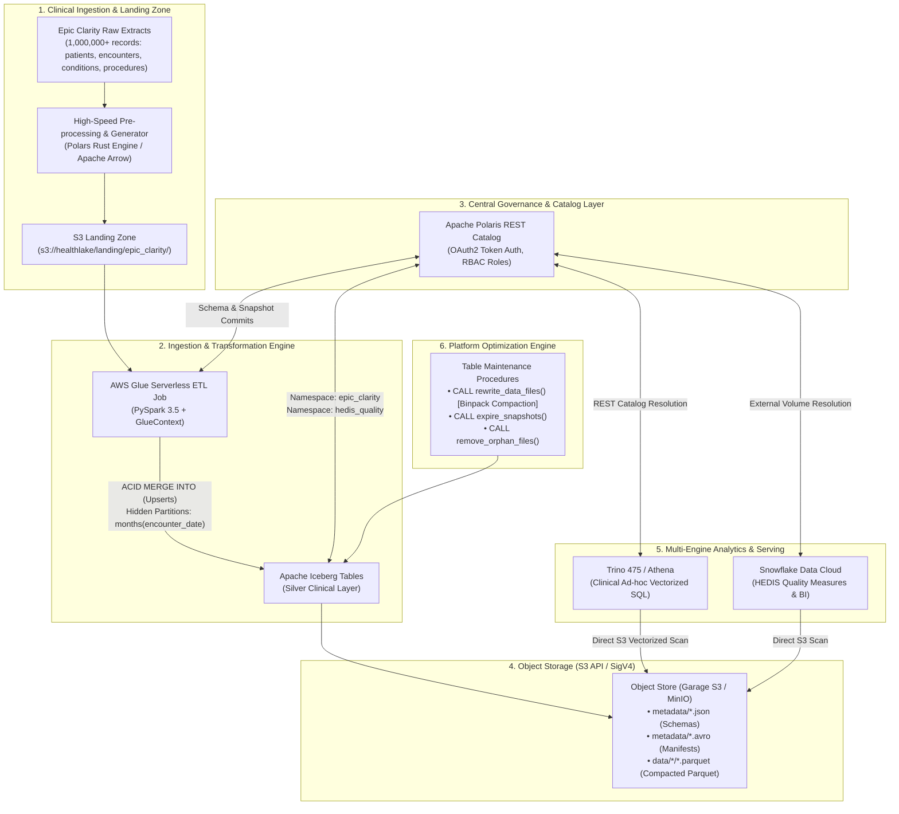
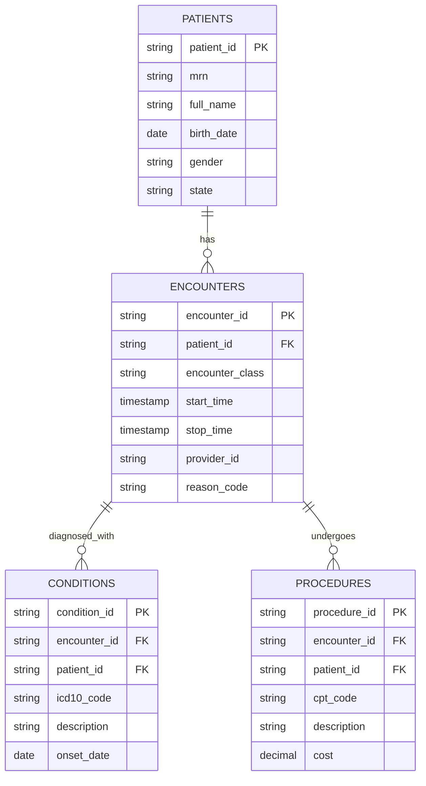

# 🏥 Enterprise Healthcare Open Data Platform: Epic Clarity to Apache Iceberg

## 📌 Executive Summary & Architecture Blueprint
This masterclass guide and technical specification serves as the foundational curriculum and implementation plan for the **AWS Data Engineer – Open Data Platform** role (8–10 Year Senior Level).

The platform ingests and models normalized **Epic Systems Clarity (EHR)** clinical data (Patients, Encounters, Conditions, Procedures) at enterprise scale (**1,000,000+ records**) into an open **Apache Iceberg** lakehouse on object storage. It is governed centrally by an **Apache Polaris REST Catalog**, pre-processed via **Polars (Rust/Arrow)**, transformed via **AWS Glue / Apache Spark**, and queried across multi-engine analytical layers (**Trino / Amazon Athena** and **Snowflake**).

---

## 🏛️ High-Level System Architecture



---

## 🗺️ AWS Production Cloud vs. $0 Free Local Twin

| Cloud Production Component | Enterprise Responsibility | 100% Free Local Twin | Code & Skill Parity |
|---|---|---|---|
| **Amazon S3** | Object storage for Parquet & Iceberg metadata | **Garage S3 / MinIO** | **100% Identical** (`S3FileIO`, AWS SigV4, endpoint routing) |
| **Local Ingestion Engine** | High-throughput data synthesis & format conversion | **Polars (Rust / Arrow)** | **Modern Standard** (Zero-copy Arrow memory, multi-threaded) |
| **AWS Glue (Spark 3.5)** | Serverless ETL, schema validation, upserts | **PySpark with GlueContext Emulation** | **100% Identical** (`GlueContext`, `DynamicFrame`, Spark SQL) |
| **Apache Polaris** | Centralized Iceberg REST Catalog & RBAC | **Apache Polaris Docker Container** | **100% Identical** (Official Iceberg REST Spec) |
| **Amazon Athena / Trino** | Ad-hoc interactive clinical queries | **Trino 475 Docker** | **100% Identical** (Athena v3 is built directly on Trino) |
| **Snowflake Cloud** | HEDIS compliance & cross-platform analytics | **Snowflake 30-Day Free Trial** | **100% Identical** (Native Polaris REST Catalog integration) |
| **AWS IAM & Networking** | Least privilege, bucket policies, VPC endpoints | **Polaris RBAC + MinIO Policies + Terraform** | **100% Identical** (IAM JSON policies, role assumptions) |

---

## 🏥 Clinical Domain Data Model: Epic Clarity to HEDIS



### Scale Targets:
* **Patients:** 50,000 – 100,000 distinct individuals.
* **Encounters:** 300,000 – 500,000 clinical encounters.
* **Conditions:** 500,000+ diagnoses with valid ICD-10-CM codes.
* **Procedures:** 500,000+ treatments/labs with CPT/SNOMED codes.
* **Total Volume:** **1,000,000+ records** partitioned across temporal dimensions.

### HEDIS Quality Measures Implemented:
1. **CDC (Comprehensive Diabetes Care):** HbA1c screening rates for diabetic patients (ICD-10 `E11.*` linked to CPT `83036`).
2. **COL (Colorectal Cancer Screening):** Adults aged 45–75 with appropriate screening procedures.
3. **CBP (Controlling High Blood Pressure):** Hypertensive patients with blood pressure controlled under guidelines.

---

## 🗂️ 22-File Repository Blueprint

```text
D:\programining\healthlake-open-platform\
├── docker/
│   ├── docker-compose.yml              # 1. Orchestrates Garage S3, Polaris, Trino, PySpark
│   ├── garage/
│   │   └── garage.toml                 # 2. S3 storage daemon configuration
│   └── trino/
│       ├── config.properties           # 3. Trino engine performance settings
│       └── catalog/
│           └── healthlake.properties   # 4. Trino connector to Polaris REST Catalog
├── src/
│   ├── data_generator/
│   │   ├── pull_clinical_dataset.py    # 5. High-speed Polars generator/streamer (1M+ records)
│   │   └── clinical_vocabularies.py    # 6. Real ICD-10 & CPT medical coding reference dictionaries
│   ├── catalog/
│   │   ├── polaris_bootstrap.py        # 7. Polaris REST API: Namespaces & OAuth2 setup
│   │   └── polaris_rbac_test.py        # 8. RBAC security test: phi_admin vs clinical_researcher
│   ├── glue_jobs/
│   │   ├── aws_glue_clarity_ingest.py  # 9. Serverless Spark ETL: Raw S3 -> Iceberg Silver (ACID MERGE)
│   │   └── aws_glue_hedis_quality.py   # 10. Spark ETL: Computes HEDIS Quality measures
│   ├── schema_evolution/
│   │   └── evolve_clinical_schema.py   # 11. In-place Iceberg schema evolution (zero file rewrite)
│   ├── maintenance/
│   │   └── table_maintenance.py        # 12. Compaction (binpack), snapshot expiry, orphan cleanup
│   └── benchmark/
│       └── glue_vs_snowflake.py        # 13. DPU vs. Snowflake Credit cost & latency benchmarking
├── snowflake/
│   ├── external_volume.sql             # 14. Snowflake DDL to read S3 Iceberg data directly
│   └── hedis_analytics.sql             # 15. Snowflake HEDIS compliance queries
├── terraform/
│   ├── main.tf                         # 16. Terraform IaC: AWS IAM Roles, S3 Buckets, VPC Endpoints
│   └── iam_policies.json               # 17. Production JSON IAM security policies
├── requirements.txt                    # 18. Polars, PyIceberg, PySpark, Boto3, PyArrow
├── .env                                # 19. S3 access keys, Polaris endpoints
├── .env.example                        # 20. Public repository credentials template
├── .gitignore                          # 21. Prevents pushing data files and secrets to Git
└── README.md                           # 22. Production-grade documentation for hiring managers
```

---

## 📊 Workload Benchmarking Model (AWS Glue vs. Snowflake)

### 1. Cost Formulations
* **AWS Glue Compute Cost:**
  $$\text{Cost}_{\text{Glue}} = \text{DPUs} \times \left(\frac{\text{Duration in Seconds}}{3600}\right) \times \$0.44$$
* **Snowflake Compute Cost (Standard Edition):**
  $$\text{Cost}_{\text{Snowflake}} = \text{Credits/Hour} \times \left(\frac{\text{Duration in Seconds}}{3600}\right) \times \$2.00$$

### 2. Architectural Trade-offs
* **Batch Ingestion & Heavy Transformations:** AWS Glue is ~40% more cost-effective due to serverless horizontal scaling and granular per-second DPU pricing.
* **Ad-hoc BI & Interactive Exploration:** Snowflake is significantly faster due to metadata pruning, materialized cache, and automatic warehouse suspend/resume.
