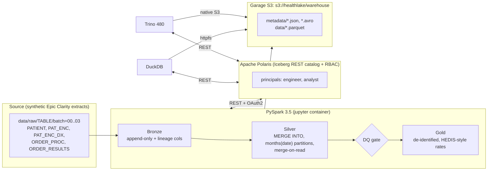

# 🧊 IceLake Health: Open Lakehouse for Clinical Data (Free, Local, Hands-on)

> **Ek line mein:** tera `icelake-local` wala hi stack (Garage S3 + Apache Polaris + PySpark/Jupyter + Trino + DuckDB, sab Docker mein, 100% free), bas data Wikipedia se badalkar **Epic Clarity-style healthcare data** ho gaya, aur upar se **Bronze/Silver/Gold, MERGE (CDC), data-quality gate, HEDIS-style measures, RBAC, time travel, benchmark** add hue.

Is file mein **do cheezein** hain:
1. Ye guide (kya, kyun, kaise, kis order mein).
2. **Appendix mein saari project files** (code, docker, configs). Ek script (`extract_files.py`) inhe automatically bana deti hai. Tujhe kuch copy-paste nahi karna.

---

## 1. `icelake-local` vs ye project

| Layer | icelake-local (tera pehle wala) | IceLake Health (ye) |
|---|---|---|
| Object storage | Garage S3 | Garage S3 (same, ab `--default-bucket` se auto setup) |
| Catalog | Polaris (`polaris:polaris` creds) | Polaris, **alag principals**: `engineer` (full), `analyst` (sirf gold) |
| ETL | PySpark 3.5 + Iceberg 1.6.1 | PySpark 3.5 + **Iceberg 1.10.0** (Glue 4/5 jaisa Spark 3.5) |
| Query engines | Trino (planned), DuckDB (planned), Snowflake (planned) | **Trino + DuckDB + Spark, teeno chalte hue**, cross-check + benchmark |
| Data | 10k Wikipedia articles, 1 table | **5 Clarity-style tables**, ~300k+ rows, 4 batches (initial + 3 incremental) |
| Modeling | 1 table | **Bronze → Silver → Gold** (medallion) |
| Write pattern | append | **MERGE INTO** (upsert, late-arriving/corrected rows) |
| Iceberg features | hidden partition, compaction, expire | + **merge-on-read, partition evolution, schema evolution, time travel, tags** |
| Quality/Security | none | **DQ gate** + **de-identified gold** + **Polaris RBAC** demo |
| Snowflake | planned | **Optional stretch** (cloud se laptop nahi dikhta, neeche explain hai) |

## 2. Architecture



**Iceberg ka core idea (interview mein yahi bolna):** catalog sirf ek *pointer* hai jo table ke latest `metadata.json` ki taraf ishara karta hai. Baaki sab (schema, snapshots, manifests, Parquet data) S3 mein plain files hain. Isliye Spark likhe aur Trino/DuckDB padhe, koi copy nahi. (Phase 11 mein `reregister` script tujhe ye khud dikha deti hai.)

## 3. Pehle spec (`healthlake_architecture_masterclass.md`) se kya fix kiya

1. Partition column ka mismatch (`encounter_date` vs `start_time`) → ab har table mein ek clear date column par `months(...)`.
2. "$0 local twin, Snowflake 100% parity" wala claim toot'ta tha (Snowflake cloud hai, laptop nahi dekh sakta) → Snowflake optional stretch, core mein **DuckDB** as 3rd engine.
3. "Glue 40% sasta / Snowflake 5x tez" jaise claims bina measurement ke the → ab **benchmark khud measure karta hai** aur pehle correctness (teeno engines same answer?) check karta hai.
4. "Epic Clarity" sirf naam tha → ab Clarity-style tables/columns (`PAT_ENC_CSN_ID`, `PAT_ENC_DX`, `ORDER_PROC`, `ORDER_RESULTS`).
5. Sirf "Silver" tha → poora Bronze/Silver/Gold.
6. HEDIS "CDC" retired/split hai (ab HBD/BPD/EED) → HBD, CBP, COL use kiye, **simplified & clearly labelled** (NCQA-certified nahi).
7. 50k rows par compaction ka fayda dikhta nahi → incremental batches se real small-files banti hain, aur 100k patients tak scale ho sakta hai.
8. Polaris RBAC table/namespace level hai, column masking nahi → PHI ko **gold mein de-identify** kiya (hashed keys, no name/DOB/ZIP), aur analyst ko sirf gold diya.

## 4. Honest status: kya test hua, kya nahi

- ✅ **Tested (maine sandbox mein chalaya):** extractor script, sab Python files compile, `init_env.sh`, data generator (schemas + counts), aur **gold HEDIS SQL + saare DQ checks** local Spark par generated data ke saath (rates plausible aaye, DQ sab pass).
- ⚠️ **Tested nahi (mere paas Docker nahi hai):** Docker Compose, Polaris REST calls, Iceberg-specific Spark (MERGE, CALL procedures), Trino, DuckDB attach. Ye official docs/guides ke hisaab se likhe hain (Polaris + Ozone/Trino guide, Garage v2.3 quick start, DuckDB Polaris attach). **1-2 chhote config hiccups aa sakte hain.** Section 8 (troubleshooting) mein likely issues aur fix diye hain. Error aaye to poora error paste kar dena, hum fix karenge.
- Ek aur baat: tere `icelake-project.md` mein S3 keys aur secrets plaintext hain. Is project mein woh `.env` mein rehte hain (gitignored, har machine par naye random). Purani file GitHub pe gayi ho to keys rotate kar dena.

## 5. Prerequisites

- **WSL2 Ubuntu + Docker** (Docker Desktop with WSL integration ya Docker Engine in WSL). Docker ko **~8 GB RAM** free chahiye (Spark 4g + Trino + Polaris + Garage). `%UserProfile%\.wslconfig` mein `memory=10GB` rakh sakta hai.
- **Repo ko WSL ke andar rakh** (`~/projects/...`), `/mnt/c` ya `/mnt/d` par nahi. Bind mounts wahan bahut slow hote hain.
- Internet (pehli baar Docker images, Maven jars, DuckDB extensions download hote hain).
- Antigravity mein folder WSL remote se khol, uska terminal use kar. **`.env` kabhi chat/agent ko paste mat kar.**

## 6. One-time setup

```bash
mkdir -p ~/projects && cd ~/projects
# is guide + extract_files.py ko yahan copy kar (Windows se: cp /mnt/c/Users/<you>/Downloads/icelake-health-master.md .)
python3 extract_files.py icelake-health-master.md icelake-health
cd icelake-health
./run.sh help
```

Ye sab files bana deta hai (docker, scripts, `src/`, docs). Neeche har phase ka command `./run.sh <cmd>` hai. Har phase ke baad `PROJECT_CHECKPOINT.md` update kar.

---

## 7. Phases (order mein karna)

### Phase 0: Environment (15 min)
```bash
./run.sh init          # .env + random secrets + garage.toml
./run.sh up            # build + start garage, polaris, jupyter (pehli baar 3-5 min)
./run.sh smoke
```
**Expected:** `[ok] Garage S3 reachable...` aur `[ok] Polaris token issued...`
**Hands-on:** `./run.sh ps`, JupyterLab `http://localhost:8888`, `./run.sh s3ls` (abhi khaali). `docker/garage/garage.toml` padh. Ek single-node S3 kaise config hota hai dekh.

### Phase 1: Synthetic Clarity-style data (10 min)
```bash
./run.sh gen --patients 20000
```
20k patients ≈ 300k encounters. **Agar RAM 12GB+ hai aur benchmark meaningful chahiye, abhi `--patients 100000 --clean` kar** (baad mein badalna = poora reload).
Batch 00 = initial load, 01-03 = monthly incrementals jisme **naye rows + kuch corrected rows** (BP re-entered, patient ka state change) hote hain, bilkul CDC feed jaisa.
**Hands-on:** DuckDB/pandas se ek parquet khol. `PAT_NAME`, `BIRTH_DATE`, `ZIP`, `PAT_MRN_ID` = PHI-jaise columns. Gold mein inhe hata denge.

### Phase 2: Polaris catalog, principals, Trino (20 min)
```bash
./run.sh catalog       # catalog `health`, namespaces bronze/silver/gold, principals engineer+analyst
./run.sh trino         # Trino ab start hota hai (isko engineer creds chahiye the)
./run.sh smoke --spark # pehli baar Spark jars download karega (1-3 min)
```
**Samajh:** Polaris RBAC chain = *principal → principal role → catalog role → privilege*. `polaris_setup.py` padh, sab REST calls saaf likhi hain. Catalog `stsUnavailable: true` hai kyunki Garage mein STS nahi, isliye Spark/Trino/DuckDB ko static S3 keys milti hain (credential vending nahi).
**Hands-on:** Trino UI `http://localhost:8080`. `./run.sh trino-cli` → `SHOW SCHEMAS;`

### Phase 3: Bronze → Silver (MERGE) (20 min)
```bash
./run.sh bronze --batches 0
./run.sh silver --batches 0
./run.sh s3ls warehouse/silver/
```
**Dekh:** `data/*.parquet` aur `metadata/*.json|avro` alag alag. Silver tables mein `months(contact_date)` **hidden partitioning** aur merge-on-read properties hain (`build_silver.py` mein).
**Hands-on:** `./run.sh silver --batches 0` dobara chala. Row counts same rehne chahiye (MERGE idempotent hai). Pehle predict kar, phir chala.

### Phase 4: Data quality + Gold + HEDIS-style measures (20 min)
```bash
./run.sh dq            # 11 checks, sab PASS
./run.sh gold
```
**Expected (approx, tere numbers thode alag honge):** HBD_LT8 ~50%, HBD_GT9 ~30%, CBP ~40-45%, COL ~10% (COL kam hai kyunki data window sirf 3 saal ka hai, code mein documented simplification).
**Hands-on:** `hedis_value_sets.py` dekh (real HEDIS mein hazaron codes ke value sets hote hain). Ek DQ check jaan-boojh ke fail karwa (e.g. threshold badal), dekh `dq` exit code 1 deta hai. Orchestrator isi se pipeline rokta hai.

### Phase 5: Incremental loads + Time travel (30 min)
```bash
./run.sh pipeline 1    # bronze 1 → silver 1 → dq → gold
./run.sh pipeline 2
./run.sh pipeline 3
./run.sh timetravel
```
**Dekh:** `silver.pat_enc` mein rows **naye rows jitne** badhe, corrected rows **duplicate nahi hue**, update hue. Gold rates har batch ke baad thode badalte hain, aur `timetravel` "pehli load vs abhi" ka delta dikhata hai + Iceberg **tag** banata hai.
**Interview line:** "Late-arriving corrections ko MERGE `update_date` se handle kiya, aur audit ke liye snapshot/tag se purani reported number reproduce ki."

### Phase 6: Schema + partition evolution (15 min)
```bash
./run.sh evolve
```
Sandbox copy par column add/rename/type-widen + `ADD PARTITION FIELD bucket(8, pat_id)`. Script **assert** karti hai ki data files ka set bilkul same hai (koi rewrite nahi). Purane rows naya column `NULL` padhte hain, time travel purana schema deta hai.

### Phase 7: Table maintenance (15 min)
Phase 5 ke baad chala, tabhi chhoti files bani hongi.
```bash
./run.sh maintain
```
`rewrite_data_files` (binpack, delete files bhi saaf), `rewrite_manifests`, `expire_snapshots`, `remove_orphan_files`. Har table ka **before/after** (data files, delete files, MB, snapshots) print hota hai. **Ye numbers `PROJECT_CHECKPOINT.md` mein likh.** Note: `expire_snapshots` purani snapshots hata deta hai, isliye `timetravel` isse *pehle* chala.

### Phase 8: Multi-engine, ek hi data (20 min)
```bash
./run.sh trino-sql     # Trino: queries, $snapshots/$files, time travel, Trino WRITE → Spark padhe
./run.sh duckdb        # DuckDB embedded, same tables via Polaris
```
**Point:** Spark ne likha, Trino aur DuckDB ne bina copy ke padha. Trino ne table likhi (`trino_smoke`) jo Spark padh sakta hai. Yahi "open lakehouse / no lock-in" ka proof hai.

### Phase 9: Benchmark (15 min)
```bash
./run.sh bench
```
Pehle **correctness** (sab engines same answer?), phir latency (1 cold + 5 warm). Output: `data/benchmarks/results.csv`, `report.md`, aur partition-pruning stat ("filter ne X of Y files touch ki"). **Sirf apne numbers report kar. Blog wale claims copy mat kar.**

### Phase 10: Security / RBAC (15 min)
```bash
./run.sh rbac
./run.sh trino-sql --rbac
```
Analyst ko sirf `gold` read diya. REST par silver = **403**, Trino mein silver query **denied**, gold **allowed**. Yahi least-privilege + PHI separation ka demo hai.

### Phase 11: Stretch (jab time ho)
- **Persistence:** in-memory Polaris restart par catalog bhool jaata hai (files S3 mein safe rehti hain). Laptop restart ke baad: `./run.sh catalog && ./run.sh trino && ./run.sh reregister` (ye script bucket scan karke latest metadata se tables dobara register karti hai). Ya Postgres-backed Polaris: `./run.sh up-persist` (official JDBC guide se compare karke chalana).
- **Airflow:** batch pipeline (`bronze → silver → dq → gold`) ko DAG bana, `dq` ka exit code failure gate ho. (Tu Airflow already jaanta hai, ye tera DeFtunes capstone se link hoga.)
- **AWS twin (paper design / Terraform):** S3 bucket + IAM + Glue jobs + Athena workgroup + Glue Data Catalog ya Polaris on ECS. **Wahi PySpark code**, sirf `common/spark.py` ka catalog config badalta hai. Sirf wahi claim kar jo actually deploy kiya. `snowflake/README.md` mein Snowflake ka honest note hai.

---

## 8. Troubleshooting (likely hiccups)

| Symptom | Likely cause → fix |
|---|---|
| `./run.sh up` error: variable missing | `./run.sh init` nahi chala. |
| `garage` container exit | `./run.sh logs garage`. `--default-bucket` ke liye image **≥ v2.3.0** chahiye (`.env` ka `GARAGE_IMAGE`). |
| Polaris token 401 / `wait_for_root` fail | Root secret `.env` mein badla par Polaris purana chal raha: `docker compose --env-file .env -f docker/docker-compose.yml up -d --force-recreate polaris`. |
| `polaris_setup` catalog create 400 | Script dono JSON shapes try karti hai. Error paste kar do. |
| Spark: `SignatureDoesNotMatch` / 403 on S3 | `garage.toml` ka `s3_region` aur `.env` ka `S3_REGION` same hone chahiye (`us-east-1`). |
| S3 errors about checksum / `aws-chunked` | Compose mein `AWS_REQUEST_CHECKSUM_CALCULATION=when_required` already hai. Fir bhi aaye to Garage image update kar. |
| Spark pehli baar bahut der | Maven jars download (ivy cache volume mein persist hota hai). |
| Trino start nahi hota | `ENGINEER_CREDENTIAL` khaali: pehle `./run.sh catalog`, phir `./run.sh trino`. `./run.sh logs trino`. |
| Trino column-case ya identifier issue | Bronze lower-case columns use karta hai; raw uppercase sirf parquet mein. |
| DuckDB attach/query fail | Iceberg extension naya hai: `pip install -U duckdb`. `ACCESS_DELEGATION_MODE 'none'` zaroori hai. Fallback: Spark + Trino se demo, DuckDB baad mein. |
| `remove_orphan_files` skipped | Script exception catch karti hai. Baaki maintenance chalta hai (previous project mein bhi yahi tha). |
| Polaris restart ke baad tables gayab | Section Phase 11 → `reregister`. Fir `./run.sh rbac` dobara. |
| Sab kuch saaf karna | `./run.sh nuke` (volumes delete) |

## 9. Resume / LinkedIn bullets (numbers apne run se bhar)

- Designed an open lakehouse for clinical (Epic Clarity-style) data on **Apache Iceberg** with **Apache Polaris** REST catalog and S3-compatible storage; Spark ETL with **MERGE INTO** CDC upserts, hidden partitioning and merge-on-read.
- Built a **Bronze/Silver/Gold** pipeline with a data-quality gate and **de-identified gold** layer; **HEDIS-style** measures (HbA1c control, BP control, colorectal screening) computed over `[N]` encounters.
- Proved **multi-engine interoperability** (Spark writes, Trino + DuckDB read/write same tables, no copies) and benchmarked engines with cross-engine correctness checks: `[your numbers]`.
- Implemented **least-privilege RBAC** in Polaris (analyst = gold only) and Iceberg **time travel/tags** for reproducible reporting; table maintenance cut `[X]` → `[Y]` data files.

---

# Appendix A: `extract_files.py` (agar alag file na mile)

Neeche wala code `extract_files.py` naam se save kar, phir `python3 extract_files.py icelake-health-master.md icelake-health`.

```python
import re, stat, sys
from pathlib import Path

md = Path(sys.argv[1]).read_text(encoding="utf-8")
target = Path(sys.argv[2] if len(sys.argv) > 2 else "icelake-health")
pattern = re.compile(r"^#### FILE: (\S+)[ \t]*\n(`{4,})[^\n]*\n(.*?)\n\2[ \t]*$", re.M | re.S)
for m in pattern.finditer(md):
    rel, _fence, body = m.groups()
    dest = target / rel
    dest.parent.mkdir(parents=True, exist_ok=True)
    with open(dest, "w", encoding="utf-8", newline="\n") as f:
        f.write(body + "\n")
    if rel.endswith(".sh"):
        dest.chmod(dest.stat().st_mode | stat.S_IXUSR | stat.S_IXGRP | stat.S_IXOTH)
    print("wrote", dest)
```

# Appendix B: All project files

> Har block `#### FILE: <path>` se shuru hota hai. **Inhe manually edit mat kar is md mein**; extract karke project folder mein edit kar.

#### FILE: .gitignore
````text
.env
data/
docker/garage/garage.toml
__pycache__/
*.pyc
.ipynb_checkpoints/
.ivy2/
spark-warehouse/
metastore_db/
derby.log
````

#### FILE: .env.example
````text
# ---------- images (pin these once everything works) ----------
POLARIS_IMAGE=apache/polaris:latest
TRINO_IMAGE=trinodb/trino:480
GARAGE_IMAGE=dxflrs/garage:v2.3.0

# ---------- object storage: Garage (S3 API) ----------
S3_BUCKET=healthlake
S3_REGION=us-east-1
S3_ENDPOINT_INTERNAL=http://garage:3900
S3_ENDPOINT_HOST=http://localhost:3900
GARAGE_DEFAULT_ACCESS_KEY=
GARAGE_DEFAULT_SECRET_KEY=
GARAGE_RPC_SECRET=
GARAGE_ADMIN_TOKEN=

# ---------- Apache Polaris (Iceberg REST catalog) ----------
POLARIS_URL=http://polaris:8181
POLARIS_REALM=POLARIS
POLARIS_ROOT_CLIENT_ID=root
POLARIS_ROOT_CLIENT_SECRET=
POLARIS_CATALOG=health

# ---------- written automatically by ./run.sh catalog ----------
ENGINEER_CLIENT_ID=
ENGINEER_CLIENT_SECRET=
ENGINEER_CREDENTIAL=
ANALYST_CLIENT_ID=
ANALYST_CLIENT_SECRET=
ANALYST_CREDENTIAL=

# ---------- project ----------
PHI_HASH_SALT=
MEASUREMENT_YEAR=2025
````

#### FILE: scripts/init_env.sh
````bash
#!/usr/bin/env bash
# Creates .env with fresh random secrets (per machine, never committed) and renders garage.toml
set -euo pipefail
cd "$(dirname "$0")/.."

[ -f .env ] || cp .env.example .env
gen() { openssl rand -hex "$1"; }
fill() { # fill KEY VALUE  -> only if KEY= is still empty
  if grep -qE "^$1=$" .env; then sed -i "s|^$1=$|$1=$2|" .env; fi
}
fill GARAGE_DEFAULT_ACCESS_KEY "GK$(gen 12)"   # Garage key ids look like GK + 24 hex chars
fill GARAGE_DEFAULT_SECRET_KEY "$(gen 32)"
fill GARAGE_RPC_SECRET "$(gen 32)"
fill GARAGE_ADMIN_TOKEN "$(gen 24)"
fill POLARIS_ROOT_CLIENT_SECRET "$(gen 16)"
fill PHI_HASH_SALT "$(gen 16)"

RPC=$(grep '^GARAGE_RPC_SECRET=' .env | cut -d= -f2)
ADMIN=$(grep '^GARAGE_ADMIN_TOKEN=' .env | cut -d= -f2)
REGION=$(grep '^S3_REGION=' .env | cut -d= -f2)

mkdir -p docker/garage
cat > docker/garage/garage.toml <<EOF
metadata_dir = "/var/lib/garage/meta"
data_dir = "/var/lib/garage/data"
db_engine = "sqlite"
replication_factor = 1

rpc_bind_addr = "[::]:3901"
rpc_public_addr = "127.0.0.1:3901"
rpc_secret = "${RPC}"

[s3_api]
s3_region = "${REGION}"
api_bind_addr = "[::]:3900"

[admin]
api_bind_addr = "[::]:3903"
admin_token = "${ADMIN}"
EOF

echo "OK: .env and docker/garage/garage.toml created (both are gitignored)."
echo "Next: ./run.sh up"
````

#### FILE: run.sh
````bash
#!/usr/bin/env bash
# Tiny task runner. ./run.sh help
set -euo pipefail
cd "$(dirname "$0")"
SELF="$PWD/run.sh"

DC="docker compose --env-file .env -f docker/docker-compose.yml"
PYX="$DC exec -T jupyter python"

cmd="${1:-help}"
shift || true

case "$cmd" in
  init)        bash scripts/init_env.sh ;;
  up)          $DC up -d --build garage polaris jupyter ;;
  up-persist)  $DC -f docker/docker-compose.persist.yml up -d --build garage postgres polaris-bootstrap polaris jupyter ;;
  catalog)     $PYX src/catalog/polaris_setup.py ;;
  trino)       $DC up -d --force-recreate trino ;;
  smoke)       $PYX src/common/smoke_test.py "$@" ;;
  gen)         $PYX src/ingestion/generate_clarity_data.py "$@" ;;
  bronze)      $PYX src/ingestion/load_bronze.py "$@" ;;
  silver)      $PYX src/transform/build_silver.py "$@" ;;
  dq)          $PYX src/quality/run_checks.py "$@" ;;
  gold)        $PYX src/transform/build_gold.py "$@" ;;
  pipeline)    b="${1:?usage: ./run.sh pipeline <batch 0-3>}"
               "$SELF" bronze --batches "$b"; "$SELF" silver --batches "$b"; "$SELF" dq; "$SELF" gold ;;
  evolve)      $PYX src/transform/schema_evolution_demo.py ;;
  maintain)    $PYX src/maintenance/table_ops.py "$@" ;;
  timetravel)  $PYX src/query/time_travel_demo.py ;;
  duckdb)      $PYX src/query/duckdb_queries.py ;;
  trino-sql)   $PYX src/query/trino_queries.py "$@" ;;
  bench)       $PYX src/benchmark/run_benchmark.py "$@" ;;
  rbac)        $PYX src/catalog/polaris_rbac.py ;;
  reregister)  $PYX src/catalog/reregister_tables.py ;;
  s3ls)        $PYX src/common/s3_ls.py "$@" ;;
  trino-cli)   $DC exec trino trino --catalog iceberg --schema gold "$@" ;;
  shell)       $DC exec jupyter bash ;;
  logs)        $DC logs -f --tail=100 "$@" ;;
  ps)          $DC ps ;;
  down)        $DC down ;;
  nuke)        echo "This deletes ALL lakehouse data (volumes)."; read -r -p "type yes: " a
               [ "$a" = "yes" ] && $DC down -v ;;
  help|*)
    cat <<'EOF'
Setup    : init | up | smoke | catalog | trino | smoke --spark
Data     : gen [--patients N --clean] | bronze --batches 0 | silver --batches 0 | dq | gold | pipeline <0-3>
Demos    : evolve | maintain | timetravel | duckdb | trino-sql [--rbac] | bench | rbac
Inspect  : s3ls [prefix] | trino-cli | shell | logs [service] | ps
Recovery : reregister   (Polaris restarted and forgot the tables? files in S3 are safe)
Teardown : down | nuke
EOF
    ;;
esac
````

#### FILE: docker/docker-compose.yml
````yaml
name: icelake-health

services:
  garage:
    image: ${GARAGE_IMAGE:-dxflrs/garage:v2.3.0}
    container_name: garage
    # --single-node + --default-bucket: Garage (>= v2.3.0) auto-creates layout, bucket and access key from env
    command: ["/garage", "server", "--single-node", "--default-bucket"]
    environment:
      GARAGE_DEFAULT_ACCESS_KEY: ${GARAGE_DEFAULT_ACCESS_KEY:?run ./run.sh init first}
      GARAGE_DEFAULT_SECRET_KEY: ${GARAGE_DEFAULT_SECRET_KEY:?run ./run.sh init first}
      GARAGE_DEFAULT_BUCKET: ${S3_BUCKET:-healthlake}
    volumes:
      - ./garage/garage.toml:/etc/garage.toml:ro
      - garage_meta:/var/lib/garage/meta
      - garage_data:/var/lib/garage/data
    ports:
      - "127.0.0.1:3900:3900"   # S3 API
      - "127.0.0.1:3903:3903"   # admin API
    restart: unless-stopped

  polaris:
    image: ${POLARIS_IMAGE:-apache/polaris:latest}
    container_name: polaris
    depends_on: [garage]
    environment:
      # realm,clientId,clientSecret  (in-memory metastore: catalog config is lost if this container restarts.
      # Metadata + data files stay safe in Garage. Re-run ./run.sh catalog, or use ./run.sh up-persist)
      POLARIS_BOOTSTRAP_CREDENTIALS: "${POLARIS_REALM:-POLARIS},${POLARIS_ROOT_CLIENT_ID:-root},${POLARIS_ROOT_CLIENT_SECRET:?run ./run.sh init first}"
      # static S3 credentials Polaris uses to write Iceberg metadata files (Garage has no STS)
      AWS_ACCESS_KEY_ID: ${GARAGE_DEFAULT_ACCESS_KEY}
      AWS_SECRET_ACCESS_KEY: ${GARAGE_DEFAULT_SECRET_KEY}
      AWS_REGION: ${S3_REGION:-us-east-1}
      # S3-compatible stores can reject the newer default AWS SDK checksum headers
      AWS_REQUEST_CHECKSUM_CALCULATION: when_required
      AWS_RESPONSE_CHECKSUM_VALIDATION: when_required
    ports:
      - "127.0.0.1:8181:8181"   # REST catalog
      - "127.0.0.1:8182:8182"   # admin / health

  jupyter:
    build:
      context: ./jupyter
    container_name: jupyter
    depends_on: [garage, polaris]
    working_dir: /workspace
    env_file: ../.env
    environment:
      PROJECT_ROOT: /workspace
      PYTHONPATH: /workspace/src
      AWS_REGION: ${S3_REGION:-us-east-1}
      AWS_REQUEST_CHECKSUM_CALCULATION: when_required
      AWS_RESPONSE_CHECKSUM_VALIDATION: when_required
    volumes:
      - ..:/workspace
      - ivy_cache:/root/.ivy2
    ports:
      - "127.0.0.1:8888:8888"   # JupyterLab (no token - localhost only)
      - "127.0.0.1:4040:4040"   # Spark UI while a job runs
    command: ["jupyter", "lab", "--ip=0.0.0.0", "--port=8888", "--no-browser", "--allow-root", "--IdentityProvider.token=", "--ServerApp.password="]

  trino:
    image: ${TRINO_IMAGE:-trinodb/trino:480}
    container_name: trino
    depends_on: [polaris]
    volumes:
      - ./trino/catalog:/etc/trino/catalog:ro
    environment:
      POLARIS_CATALOG: ${POLARIS_CATALOG:-health}
      ENGINEER_CREDENTIAL: ${ENGINEER_CREDENTIAL:-}
      ANALYST_CREDENTIAL: ${ANALYST_CREDENTIAL:-}
      GARAGE_ACCESS_KEY: ${GARAGE_DEFAULT_ACCESS_KEY}
      GARAGE_SECRET_KEY: ${GARAGE_DEFAULT_SECRET_KEY}
      AWS_REQUEST_CHECKSUM_CALCULATION: when_required
      AWS_RESPONSE_CHECKSUM_VALIDATION: when_required
    ports:
      - "127.0.0.1:8080:8080"   # Trino UI + SQL (user: any name, no password)

volumes:
  garage_meta:
  garage_data:
  ivy_cache:
````

#### FILE: docker/docker-compose.persist.yml
````yaml
# OPTIONAL (Phase 11): Polaris with a Postgres metastore so catalog state survives restarts.
# Based on Polaris' own relational-JDBC guide (https://polaris.apache.org/guides/jdbc/).
# Env var names can change between Polaris releases -> if it fails, compare with that guide.
# Usage: ./run.sh up-persist   then   ./run.sh catalog
services:
  postgres:
    image: postgres:17
    container_name: polaris-postgres
    environment:
      POSTGRES_USER: polaris
      POSTGRES_PASSWORD: polaris
      POSTGRES_DB: POLARIS
    volumes:
      - pg_data:/var/lib/postgresql/data
    healthcheck:
      test: ["CMD-SHELL", "pg_isready -U polaris -d POLARIS"]
      interval: 5s
      timeout: 5s
      retries: 10

  polaris-bootstrap:
    image: apache/polaris-admin-tool:latest
    container_name: polaris-bootstrap
    depends_on:
      postgres:
        condition: service_healthy
    environment:
      POLARIS_PERSISTENCE_TYPE: relational-jdbc
      QUARKUS_DATASOURCE_JDBC_URL: jdbc:postgresql://postgres:5432/POLARIS
      QUARKUS_DATASOURCE_USERNAME: polaris
      QUARKUS_DATASOURCE_PASSWORD: polaris
    command:
      - "bootstrap"
      - "--realm=${POLARIS_REALM:-POLARIS}"
      - "--credential=${POLARIS_REALM:-POLARIS},${POLARIS_ROOT_CLIENT_ID:-root},${POLARIS_ROOT_CLIENT_SECRET}"

  polaris:
    depends_on:
      polaris-bootstrap:
        condition: service_completed_successfully
    environment:
      POLARIS_PERSISTENCE_TYPE: relational-jdbc
      QUARKUS_DATASOURCE_JDBC_URL: jdbc:postgresql://postgres:5432/POLARIS
      QUARKUS_DATASOURCE_USERNAME: polaris
      QUARKUS_DATASOURCE_PASSWORD: polaris

volumes:
  pg_data:
````

#### FILE: docker/jupyter/Dockerfile
````dockerfile
FROM python:3.11-slim-bookworm

RUN apt-get update \
 && apt-get install -y --no-install-recommends openjdk-17-jre-headless procps curl \
 && rm -rf /var/lib/apt/lists/*

COPY requirements.txt /tmp/requirements.txt
RUN pip install --no-cache-dir -r /tmp/requirements.txt

WORKDIR /workspace
````

#### FILE: docker/jupyter/requirements.txt
````text
pyspark==3.5.3
jupyterlab>=4.2
duckdb>=1.4.0
pandas>=2.2,<3
numpy>=1.26,<2
pyarrow>=15
requests>=2.31
python-dotenv>=1.0
trino>=0.330
boto3>=1.34
matplotlib>=3.8
````

#### FILE: docker/trino/catalog/iceberg.properties
````properties
# Trino catalog `iceberg`  ->  Polaris REST catalog, as principal `engineer` (full access)
# ${ENV:...} values come from the trino service environment in docker-compose.yml
connector.name=iceberg
iceberg.catalog.type=rest
iceberg.rest-catalog.uri=http://polaris:8181/api/catalog
iceberg.rest-catalog.warehouse=${ENV:POLARIS_CATALOG}
iceberg.rest-catalog.security=OAUTH2
iceberg.rest-catalog.oauth2.credential=${ENV:ENGINEER_CREDENTIAL}
iceberg.rest-catalog.oauth2.scope=PRINCIPAL_ROLE:ALL
iceberg.rest-catalog.oauth2.server-uri=http://polaris:8181/api/catalog/v1/oauth/tokens
# Garage has no STS -> static S3 keys (native S3 filesystem)
fs.native-s3.enabled=true
s3.endpoint=http://garage:3900
s3.region=us-east-1
s3.path-style-access=true
s3.aws-access-key=${ENV:GARAGE_ACCESS_KEY}
s3.aws-secret-key=${ENV:GARAGE_SECRET_KEY}
````

#### FILE: docker/trino/catalog/iceberg_analyst.properties
````properties
# Trino catalog `iceberg_analyst` -> same Polaris, but logs in as principal `analyst` (gold-only after ./run.sh rbac)
connector.name=iceberg
iceberg.catalog.type=rest
iceberg.rest-catalog.uri=http://polaris:8181/api/catalog
iceberg.rest-catalog.warehouse=${ENV:POLARIS_CATALOG}
iceberg.rest-catalog.security=OAUTH2
iceberg.rest-catalog.oauth2.credential=${ENV:ANALYST_CREDENTIAL}
iceberg.rest-catalog.oauth2.scope=PRINCIPAL_ROLE:ALL
iceberg.rest-catalog.oauth2.server-uri=http://polaris:8181/api/catalog/v1/oauth/tokens
fs.native-s3.enabled=true
s3.endpoint=http://garage:3900
s3.region=us-east-1
s3.path-style-access=true
s3.aws-access-key=${ENV:GARAGE_ACCESS_KEY}
s3.aws-secret-key=${ENV:GARAGE_SECRET_KEY}
````
#### FILE: src/__init__.py
````python
# package
````

#### FILE: src/common/__init__.py
````python
# package
````

#### FILE: src/common/config.py
````python
"""Shared config. Reads .env (project root) every time a script starts."""
from __future__ import annotations

import os
import re
from pathlib import Path

from dotenv import load_dotenv

ROOT = Path(os.environ.get("PROJECT_ROOT", Path(__file__).resolve().parents[2]))
ENV_FILE = ROOT / ".env"
load_dotenv(ENV_FILE, override=True)


def env(key: str, default: str | None = None, required: bool = False) -> str | None:
    val = os.getenv(key, default)
    if required and not val:
        raise SystemExit(f"Missing {key} in {ENV_FILE}. Did you run ./run.sh init and ./run.sh catalog?")
    return val or default


def update_env(updates: dict[str, str]) -> None:
    """Write/replace KEY=VALUE lines in .env (keeps everything else)."""
    lines = ENV_FILE.read_text().splitlines() if ENV_FILE.exists() else []
    for key, value in updates.items():
        pattern = re.compile(rf"^{re.escape(key)}=")
        for i, line in enumerate(lines):
            if pattern.match(line):
                lines[i] = f"{key}={value}"
                break
        else:
            lines.append(f"{key}={value}")
        os.environ[key] = value
    ENV_FILE.write_text("\n".join(lines) + "\n")


POLARIS_URL = env("POLARIS_URL", "http://polaris:8181")
CATALOG = env("POLARIS_CATALOG", "health")
S3_ENDPOINT = env("S3_ENDPOINT_INTERNAL", "http://garage:3900")
S3_REGION = env("S3_REGION", "us-east-1")
S3_BUCKET = env("S3_BUCKET", "healthlake")
S3_KEY = env("GARAGE_DEFAULT_ACCESS_KEY")
S3_SECRET = env("GARAGE_DEFAULT_SECRET_KEY")
SALT = env("PHI_HASH_SALT", "dev-salt")
MEASUREMENT_YEAR = int(env("MEASUREMENT_YEAR", "2025"))


def creds(role: str) -> tuple[str, str]:
    """role = 'engineer' | 'analyst' -> (client_id, client_secret)"""
    cid = env(f"{role.upper()}_CLIENT_ID")
    sec = env(f"{role.upper()}_CLIENT_SECRET")
    if not cid or not sec:
        raise SystemExit(f"No credentials for '{role}'. Run: ./run.sh catalog")
    return cid, sec
````

#### FILE: src/common/spark.py
````python
"""One place that builds the SparkSession wired to Polaris (REST) + Garage (S3).

Catalog alias inside Spark is `lake`  ->  tables are lake.<namespace>.<table>
NOTE: we do NOT send X-Iceberg-Access-Delegation. Garage has no STS, so no credential vending;
Spark uses the static S3 keys below (Polaris catalog has stsUnavailable=true).
"""
from __future__ import annotations

from pyspark.sql import SparkSession

from common.config import CATALOG, POLARIS_URL, S3_ENDPOINT, S3_KEY, S3_REGION, S3_SECRET, creds

ICEBERG_VERSION = "1.10.0"
PACKAGES = ",".join(
    [
        f"org.apache.iceberg:iceberg-spark-runtime-3.5_2.12:{ICEBERG_VERSION}",
        f"org.apache.iceberg:iceberg-aws-bundle:{ICEBERG_VERSION}",
    ]
)


def get_spark(app: str = "healthlake", role: str = "engineer", driver_memory: str = "4g") -> SparkSession:
    cid, secret = creds(role)
    c = "spark.sql.catalog.lake"
    spark = (
        SparkSession.builder.appName(app)
        .master("local[*]")
        .config("spark.driver.memory", driver_memory)
        .config("spark.jars.packages", PACKAGES)
        .config("spark.sql.session.timeZone", "UTC")
        .config("spark.sql.shuffle.partitions", "8")
        .config("spark.sql.extensions", "org.apache.iceberg.spark.extensions.IcebergSparkSessionExtensions")
        .config("spark.sql.defaultCatalog", "lake")
        .config(c, "org.apache.iceberg.spark.SparkCatalog")
        .config(f"{c}.type", "rest")
        .config(f"{c}.uri", f"{POLARIS_URL}/api/catalog")
        .config(f"{c}.warehouse", CATALOG)
        .config(f"{c}.credential", f"{cid}:{secret}")
        .config(f"{c}.oauth2-server-uri", f"{POLARIS_URL}/api/catalog/v1/oauth/tokens")
        .config(f"{c}.scope", "PRINCIPAL_ROLE:ALL")
        .config(f"{c}.io-impl", "org.apache.iceberg.aws.s3.S3FileIO")
        .config(f"{c}.s3.endpoint", S3_ENDPOINT)
        .config(f"{c}.s3.path-style-access", "true")
        .config(f"{c}.s3.access-key-id", S3_KEY)
        .config(f"{c}.s3.secret-access-key", S3_SECRET)
        .config(f"{c}.client.region", S3_REGION)
        .getOrCreate()
    )
    spark.sparkContext.setLogLevel("WARN")
    return spark
````

#### FILE: src/common/hedis_value_sets.py
````python
"""Simplified code lists used by the HEDIS-style measures.

Real HEDIS uses NCQA value sets (VSAC) with hundreds of codes (ICD-10, CPT, LOINC, SNOMED...).
These short lists are ONLY for learning. Do not present results as NCQA-certified.
"""

DIABETES_DX_PREFIX = "E11"          # Type 2 diabetes mellitus
HYPERTENSION_DX = ("I10",)          # Essential hypertension
A1C_COMPONENT = "HEMOGLOBIN A1C"    # result component name in ORDER_RESULTS
A1C_CPT = "83036"
COLONOSCOPY_CPT = ("45378",)
FIT_CPT = ("82274",)


def sql_in(values) -> str:
    return ", ".join(f"'{v}'" for v in values)
````

#### FILE: src/common/s3_ls.py
````python
"""Peek into the bucket: shows what Iceberg actually wrote (data/ + metadata/)."""
import sys
from collections import Counter

import boto3
from botocore.config import Config

from common.config import S3_BUCKET, S3_ENDPOINT, S3_KEY, S3_REGION, S3_SECRET

prefix = sys.argv[1] if len(sys.argv) > 1 else "warehouse/"
s3 = boto3.client(
    "s3",
    endpoint_url=S3_ENDPOINT,
    aws_access_key_id=S3_KEY,
    aws_secret_access_key=S3_SECRET,
    region_name=S3_REGION,
    config=Config(s3={"addressing_style": "path"}),
)
count, size, kinds = 0, 0, Counter()
for page in s3.get_paginator("list_objects_v2").paginate(Bucket=S3_BUCKET, Prefix=prefix):
    for obj in page.get("Contents", []):
        count += 1
        size += obj["Size"]
        kinds[obj["Key"].rsplit(".", 1)[-1]] += 1
        if count <= 15:
            print(f"{obj['Size']:>10,}  {obj['Key']}")
print(f"\n{count} objects, {size / 1e6:.1f} MB under s3://{S3_BUCKET}/{prefix}")
print("by extension:", dict(kinds))
````

#### FILE: src/common/smoke_test.py
````python
"""./run.sh smoke            -> checks Garage (S3) + Polaris login
   ./run.sh smoke --spark    -> also creates/drops a tiny Iceberg table via Spark (after ./run.sh catalog)"""
import sys

import boto3
import requests
from botocore.config import Config

from common.config import POLARIS_URL, S3_BUCKET, S3_ENDPOINT, S3_KEY, S3_REGION, S3_SECRET, env


def check_s3():
    s3 = boto3.client(
        "s3",
        endpoint_url=S3_ENDPOINT,
        aws_access_key_id=S3_KEY,
        aws_secret_access_key=S3_SECRET,
        region_name=S3_REGION,
        config=Config(s3={"addressing_style": "path"}),
    )
    buckets = [b["Name"] for b in s3.list_buckets()["Buckets"]]
    assert S3_BUCKET in buckets, f"bucket {S3_BUCKET} missing, have {buckets}"
    s3.put_object(Bucket=S3_BUCKET, Key="_smoke/hello.txt", Body=b"hello")
    assert s3.get_object(Bucket=S3_BUCKET, Key="_smoke/hello.txt")["Body"].read() == b"hello"
    s3.delete_object(Bucket=S3_BUCKET, Key="_smoke/hello.txt")
    print(f"[ok] Garage S3 reachable, bucket '{S3_BUCKET}' read/write works")


def check_polaris():
    r = requests.post(
        f"{POLARIS_URL}/api/catalog/v1/oauth/tokens",
        data={
            "grant_type": "client_credentials",
            "client_id": env("POLARIS_ROOT_CLIENT_ID", "root"),
            "client_secret": env("POLARIS_ROOT_CLIENT_SECRET", required=True),
            "scope": "PRINCIPAL_ROLE:ALL",
        },
        timeout=20,
    )
    r.raise_for_status()
    print("[ok] Polaris token issued for root principal")


def check_spark():
    from common.spark import get_spark

    spark = get_spark("smoke")
    spark.sql("SHOW NAMESPACES").show()
    spark.sql("CREATE TABLE IF NOT EXISTS lake.bronze._smoke (id INT) USING iceberg")
    spark.sql("INSERT INTO lake.bronze._smoke VALUES (1), (2)")
    assert spark.table("lake.bronze._smoke").count() == 2
    spark.sql("DROP TABLE lake.bronze._smoke PURGE")
    print("[ok] Spark -> Polaris -> Garage round trip works")


if __name__ == "__main__":
    check_s3()
    check_polaris()
    if "--spark" in sys.argv:
        check_spark()
````

#### FILE: src/catalog/__init__.py
````python
# package
````

#### FILE: src/catalog/polaris_setup.py
````python
#!/usr/bin/env python
"""Bootstrap Polaris (idempotent - safe to re-run):
   catalog `health` on Garage S3, namespaces bronze/silver/gold,
   principals `engineer` (full access) and `analyst` (locked down later by polaris_rbac.py).
Writes the generated client credentials back into .env."""
from __future__ import annotations

import sys
import time

import requests

from common.config import CATALOG, POLARIS_URL, S3_BUCKET, S3_ENDPOINT, env, update_env

CAT = f"{POLARIS_URL}/api/catalog/v1"
MGMT = f"{POLARIS_URL}/api/management/v1"


def token(client_id: str, client_secret: str) -> str:
    r = requests.post(
        f"{CAT}/oauth/tokens",
        data={
            "grant_type": "client_credentials",
            "client_id": client_id,
            "client_secret": client_secret,
            "scope": "PRINCIPAL_ROLE:ALL",
        },
        timeout=30,
    )
    r.raise_for_status()
    return r.json()["access_token"]


def hdr(t: str) -> dict:
    return {"Authorization": f"Bearer {t}", "Content-Type": "application/json"}


def wait_for_root() -> str:
    last = None
    for _ in range(60):
        try:
            return token(env("POLARIS_ROOT_CLIENT_ID", "root"), env("POLARIS_ROOT_CLIENT_SECRET", required=True))
        except Exception as e:  # noqa: BLE001
            last = e
            time.sleep(2)
    sys.exit(f"Polaris not reachable / root credentials rejected: {last}\nTry: ./run.sh logs polaris")


def post(url: str, t: str, *bodies: dict, label: str):
    """POST trying each body shape in order (Polaris versions differ: flat vs wrapped JSON)."""
    last = None
    for body in bodies:
        r = requests.post(url, headers=hdr(t), json=body, timeout=30)
        if r.status_code in (200, 201):
            print(f"  + {label}")
            return r
        if r.status_code == 409:
            print(f"  = {label} (already exists)")
            return r
        last = r
    sys.exit(f"FAILED {label}: HTTP {last.status_code} {last.text}")


def put(url: str, t: str, body: dict, label: str) -> None:
    r = requests.put(url, headers=hdr(t), json=body, timeout=30)
    if r.status_code not in (200, 201, 204):
        sys.exit(f"FAILED {label}: HTTP {r.status_code} {r.text}")
    print(f"  + {label}")


def ensure_principal(root: str, name: str) -> tuple[str, str]:
    key = name.upper()
    cid, sec = env(f"{key}_CLIENT_ID"), env(f"{key}_CLIENT_SECRET")
    if cid and sec:
        try:
            token(cid, sec)
            print(f"  = principal {name} (existing credentials still valid)")
            return cid, sec
        except Exception:  # noqa: BLE001
            pass
    flat = {"name": name, "type": "SERVICE"}
    r = post(f"{MGMT}/principals", root, flat, {"principal": flat}, label=f"principal {name}")
    if r.status_code == 409:  # exists but we lost the secret -> rotate by delete + create
        requests.delete(f"{MGMT}/principals/{name}", headers=hdr(root), timeout=30)
        r = post(f"{MGMT}/principals", root, flat, {"principal": flat}, label=f"principal {name} (recreated)")
    c = r.json()["credentials"]
    return c["clientId"], c["clientSecret"]


def main() -> None:
    print("1) root token")
    root = wait_for_root()

    print("2) catalog (Garage S3, static creds, no STS)")
    storage = {
        "storageType": "S3",
        "allowedLocations": [f"s3://{S3_BUCKET}/"],
        "endpoint": S3_ENDPOINT,
        "endpointInternal": S3_ENDPOINT,
        "stsUnavailable": True,
        "pathStyleAccess": True,
    }
    flat = {
        "name": CATALOG,
        "type": "INTERNAL",
        "properties": {"default-base-location": f"s3://{S3_BUCKET}/warehouse"},
        "storageConfigInfo": storage,
    }
    post(f"{MGMT}/catalogs", root, flat, {"catalog": flat}, label=f"catalog {CATALOG}")

    print("3) principals")
    eng_id, eng_secret = ensure_principal(root, "engineer")
    ana_id, ana_secret = ensure_principal(root, "analyst")

    print("4) roles + grants (engineer gets full content access)")
    for pr in ("data_engineer", "data_analyst"):
        post(f"{MGMT}/principal-roles", root, {"principalRole": {"name": pr}}, {"name": pr}, label=f"principal-role {pr}")
    put(f"{MGMT}/principals/engineer/principal-roles", root, {"principalRole": {"name": "data_engineer"}}, "engineer -> data_engineer")
    put(f"{MGMT}/principals/analyst/principal-roles", root, {"principalRole": {"name": "data_analyst"}}, "analyst  -> data_analyst")
    post(
        f"{MGMT}/catalogs/{CATALOG}/catalog-roles",
        root,
        {"catalogRole": {"name": "engineer_full"}},
        {"name": "engineer_full"},
        label="catalog-role engineer_full",
    )
    put(
        f"{MGMT}/catalogs/{CATALOG}/catalog-roles/engineer_full/grants",
        root,
        {"grant": {"type": "catalog", "privilege": "CATALOG_MANAGE_CONTENT"}},
        "engineer_full: CATALOG_MANAGE_CONTENT",
    )
    put(
        f"{MGMT}/principal-roles/data_engineer/catalog-roles/{CATALOG}",
        root,
        {"catalogRole": {"name": "engineer_full"}},
        "data_engineer -> engineer_full",
    )

    print("5) namespaces (medallion layers)")
    eng = token(eng_id, eng_secret)
    for ns in ("bronze", "silver", "gold"):
        post(f"{CAT}/{CATALOG}/namespaces", eng, {"namespace": [ns], "properties": {}}, label=f"namespace {ns}")

    update_env(
        {
            "ENGINEER_CLIENT_ID": eng_id,
            "ENGINEER_CLIENT_SECRET": eng_secret,
            "ENGINEER_CREDENTIAL": f"{eng_id}:{eng_secret}",
            "ANALYST_CLIENT_ID": ana_id,
            "ANALYST_CLIENT_SECRET": ana_secret,
            "ANALYST_CREDENTIAL": f"{ana_id}:{ana_secret}",
        }
    )
    print("\nDone. Credentials saved to .env. Next: ./run.sh trino")


if __name__ == "__main__":
    main()
````

#### FILE: src/catalog/polaris_rbac.py
````python
#!/usr/bin/env python
"""Phase 10 - least-privilege access.
   analyst may: list namespaces, and READ tables in namespace `gold` only.
   analyst may NOT: touch bronze/silver (they hold PHI-like columns: names, birth dates, ZIP).
Then proves it with real REST calls made as the analyst."""
from __future__ import annotations

import requests

from catalog.polaris_setup import CAT, MGMT, hdr, post, put, token
from common.config import CATALOG, creds, env

GOLD_PRIVS = ["TABLE_LIST", "NAMESPACE_READ_PROPERTIES", "TABLE_READ_PROPERTIES", "TABLE_READ_DATA"]


def main() -> None:
    root = token(env("POLARIS_ROOT_CLIENT_ID", "root"), env("POLARIS_ROOT_CLIENT_SECRET", required=True))

    post(
        f"{MGMT}/catalogs/{CATALOG}/catalog-roles",
        root,
        {"catalogRole": {"name": "analyst_gold_read"}},
        {"name": "analyst_gold_read"},
        label="catalog-role analyst_gold_read",
    )
    grants_url = f"{MGMT}/catalogs/{CATALOG}/catalog-roles/analyst_gold_read/grants"
    put(grants_url, root, {"grant": {"type": "catalog", "privilege": "NAMESPACE_LIST"}}, "catalog-level: NAMESPACE_LIST")
    for priv in GOLD_PRIVS:
        put(grants_url, root, {"grant": {"type": "namespace", "namespace": ["gold"], "privilege": priv}}, f"namespace gold: {priv}")
    put(
        f"{MGMT}/principal-roles/data_analyst/catalog-roles/{CATALOG}",
        root,
        {"catalogRole": {"name": "analyst_gold_read"}},
        "data_analyst -> analyst_gold_read",
    )

    print("\nVerifying as `analyst` ...")
    cid, sec = creds("analyst")
    t = token(cid, sec)
    checks = [
        ("silver.patient  (expect 403 Forbidden)", "silver", "patient"),
        ("bronze.patient  (expect 403 Forbidden)", "bronze", "patient"),
        ("gold.hedis_rates (expect 200 OK, or 404 if gold not built yet)", "gold", "hedis_rates"),
    ]
    for label, ns, table in checks:
        r = requests.get(f"{CAT}/{CATALOG}/namespaces/{ns}/tables/{table}", headers=hdr(t), timeout=30)
        print(f"  {label:<62} -> HTTP {r.status_code}")
    print("\nNow try the same from Trino:  ./run.sh trino-sql --rbac")


if __name__ == "__main__":
    main()
````

#### FILE: src/catalog/delete_catalog.py
````python
#!/usr/bin/env python
"""Teardown helper: purge all tables, drop namespaces, delete the catalog. (Use ./run.sh nuke to wipe everything instead.)"""
import requests

from catalog.polaris_setup import CAT, MGMT, hdr, token
from common.config import CATALOG, env
from common.spark import get_spark

spark = get_spark("teardown")
for ns in ("bronze", "silver", "gold"):
    try:
        for row in spark.sql(f"SHOW TABLES IN lake.{ns}").collect():
            print(f"drop {ns}.{row.tableName}")
            spark.sql(f"DROP TABLE lake.{ns}.{row.tableName} PURGE")
    except Exception as e:  # noqa: BLE001
        print(f"skip {ns}: {e}")

root = token(env("POLARIS_ROOT_CLIENT_ID", "root"), env("POLARIS_ROOT_CLIENT_SECRET", required=True))
for ns in ("bronze", "silver", "gold"):
    requests.delete(f"{CAT}/{CATALOG}/namespaces/{ns}", headers=hdr(root), timeout=30)
r = requests.delete(f"{MGMT}/catalogs/{CATALOG}", headers=hdr(root), timeout=30)
print("delete catalog ->", r.status_code)
````
#### FILE: src/ingestion/__init__.py
````python
# package
````

#### FILE: src/ingestion/generate_clarity_data.py
````python
#!/usr/bin/env python
"""Synthetic Epic-Clarity-style extract generator. Everything is random - no real patient data.

Tables (Clarity-style names/columns):  PATIENT, PAT_ENC, PAT_ENC_DX, ORDER_PROC, ORDER_RESULTS
Output : data/raw/<TABLE>/batch=NN/part-0.parquet
         batch 00 = initial full load (visits before 2025-10-01)
         batch 01..03 = monthly incrementals (new rows + a few corrected/updated rows, like a real CDC feed)

Usage  : ./run.sh gen --patients 20000        (default)
         ./run.sh gen --patients 100000 --clean   (millions of rows -> better benchmarks)
"""
from __future__ import annotations

import argparse
import shutil
from pathlib import Path

import numpy as np
import pandas as pd

ROOT = Path(__file__).resolve().parents[2]

FIRST = ["Aarav", "Maria", "James", "Priya", "Wei", "Fatima", "John", "Sofia", "Ahmed", "Emily", "Liam", "Olivia", "Noah", "Mei", "Carlos", "Anna"]
LAST = ["Smith", "Khan", "Garcia", "Chen", "Patel", "Johnson", "Lee", "Brown", "Nguyen", "Davis", "Miller", "Wilson", "Ali", "Lopez", "Kim", "Singh"]
STATES = np.array(["CA", "TX", "NY", "FL", "IL", "PA", "OH", "GA", "NC", "MI"])
ENC_TYPES = np.array(["Office Visit", "Telehealth", "Emergency", "Inpatient"])
ENC_P = [0.62, 0.18, 0.15, 0.05]

COMMON = {
    "J06.9": ("Acute upper respiratory infection", 0.16),
    "M54.50": ("Low back pain", 0.10),
    "E78.5": ("Hyperlipidemia", 0.07),
    "J45.909": ("Asthma", 0.07),
    "F41.9": ("Anxiety disorder", 0.08),
    "K21.9": ("GERD", 0.08),
    "Z00.00": ("General adult medical exam", 0.20),
    "N39.0": ("Urinary tract infection", 0.05),
    "E66.9": ("Obesity", 0.06),
    "R51.9": ("Headache", 0.10),
}
DM = {
    "E11.9": ("Type 2 diabetes without complications", 0.60),
    "E11.65": ("Type 2 diabetes with hyperglycemia", 0.25),
    "E11.22": ("Type 2 diabetes with diabetic CKD", 0.15),
}
HTN = {"I10": ("Essential hypertension", 1.0)}
DX_NAMES = {k: v[0] for d in (COMMON, DM, HTN) for k, v in d.items()}
DX_IDS = {code: 1000 + i for i, code in enumerate(DX_NAMES)}

PROC_NAMES = {
    "99213": "Office visit, established patient",
    "99285": "Emergency department visit, high severity",
    "99223": "Initial hospital care, high complexity",
    "83036": "Hemoglobin A1c",
    "80061": "Lipid panel",
    "82274": "FIT (fecal immunochemical test)",
    "45378": "Colonoscopy, diagnostic",
}

START = np.datetime64("2023-01-01")
END = np.datetime64("2025-12-31")
CUTS = np.array(["2025-10-01", "2025-11-01", "2025-12-01"], dtype="datetime64[ns]")
EXTRACT_TS = [pd.Timestamp(x) for x in ("2025-10-01", "2025-11-01", "2025-12-01", "2026-01-01")]

DATE_COLS = {
    "PATIENT": ["BIRTH_DATE"],
    "PAT_ENC": ["CONTACT_DATE"],
    "PAT_ENC_DX": ["CONTACT_DATE"],
    "ORDER_PROC": ["ORDERING_DATE"],
    "ORDER_RESULTS": ["RESULT_DATE"],
}


def batch_of(dates: np.ndarray) -> np.ndarray:
    return np.searchsorted(CUTS, dates.astype("datetime64[ns]"), side="right")


def write(df: pd.DataFrame, table: str, batch: int, out: Path) -> None:
    d = out / table / f"batch={batch:02d}"
    d.mkdir(parents=True, exist_ok=True)
    df = df.copy()
    for c in DATE_COLS.get(table, []):
        df[c] = pd.to_datetime(df[c]).dt.date
    # Spark 3.5 cannot read nanosecond timestamps -> force microseconds
    df.to_parquet(d / "part-0.parquet", index=False, coerce_timestamps="us", allow_truncated_timestamps=True)


def main() -> None:
    ap = argparse.ArgumentParser()
    ap.add_argument("--patients", type=int, default=20000)
    ap.add_argument("--seed", type=int, default=42)
    ap.add_argument("--out", default=str(ROOT / "data" / "raw"))
    ap.add_argument("--clean", action="store_true", help="delete existing data/raw first")
    a = ap.parse_args()
    out = Path(a.out)
    if a.clean and out.exists():
        shutil.rmtree(out)
    rng = np.random.default_rng(a.seed)
    n = a.patients

    # ------------------------------------------------------------------ patients
    age = np.clip(rng.normal(48, 22, n), 2, 95).astype(int)
    birth = END - (age * 365.25 + rng.integers(0, 365, n)).astype("timedelta64[D]")
    pat_ids = np.array([f"Z{i:07d}" for i in range(1, n + 1)])
    p_dm = 0.02 + 0.13 * (age >= 40) + 0.05 * (age >= 60)
    p_htn = 0.04 + 0.22 * (age >= 40) + 0.20 * (age >= 60)
    has_dm = rng.random(n) < p_dm
    has_htn = rng.random(n) < p_htn
    base_a1c = np.where(has_dm, rng.normal(7.7, 1.4, n), 5.4)
    base_sys = np.where(has_htn, rng.normal(138, 11, n), rng.normal(117, 9, n))

    # ------------------------------------------------------------------ encounters
    lam = (3 + 2.5 * has_dm + 2.5 * has_htn + age / 40) * 3.0
    n_enc = rng.poisson(lam)
    m = int(n_enc.sum())
    pidx = np.repeat(np.arange(n), n_enc)
    ndays = int((END - START) / np.timedelta64(1, "D"))
    cd = (START + rng.integers(0, ndays + 1, m).astype("timedelta64[D]")).astype("datetime64[ns]")
    order = np.lexsort((cd, pidx))
    cd, pidx = cd[order], pidx[order]
    csn = 900_000_000 + np.arange(m, dtype="int64")
    upd = cd + np.timedelta64(1, "D")

    status = rng.choice(["Completed", "Canceled", "No Show"], m, p=[0.93, 0.04, 0.03])
    typ = rng.choice(ENC_TYPES, m, p=ENC_P)
    comp = status == "Completed"
    rec_bp = comp & (rng.random(m) < np.where(typ == "Telehealth", 0.15, 0.92))
    sys_bp = np.round(base_sys[pidx] + rng.normal(0, 9, m))
    dia_bp = np.round(0.62 * sys_bp + rng.normal(4, 5, m))
    bp_s = pd.Series(np.where(rec_bp, sys_bp, np.nan)).astype("Int32")
    bp_d = pd.Series(np.where(rec_bp, dia_bp, np.nan)).astype("Int32")

    inp = (typ == "Inpatient") & comp
    adm = np.full(m, np.datetime64("NaT"), dtype="datetime64[ns]")
    dis = np.full(m, np.datetime64("NaT"), dtype="datetime64[ns]")
    adm[inp] = cd[inp] + rng.integers(8, 20, inp.sum()).astype("timedelta64[h]")
    dis[inp] = adm[inp] + rng.integers(1, 8, inp.sum()).astype("timedelta64[D]")

    enc = pd.DataFrame(
        {
            "PAT_ENC_CSN_ID": csn,
            "PAT_ID": pat_ids[pidx],
            "CONTACT_DATE": cd,
            "ENC_TYPE": typ,
            "DEPARTMENT_ID": rng.integers(1000, 1030, m).astype("int64"),
            "VISIT_PROV_ID": np.char.add("P", rng.integers(100, 400, m).astype(str)),
            "APPT_STATUS": status,
            "BP_SYSTOLIC": bp_s,
            "BP_DIASTOLIC": bp_d,
            "HOSP_ADMSN_TIME": adm,
            "HOSP_DISCH_TIME": dis,
            "UPDATE_DATE": upd,
        }
    )
    enc_b = batch_of(cd)

    # ------------------------------------------------------------------ diagnoses
    dm_e, htn_e = has_dm[pidx], has_htn[pidx]
    dm_codes, dm_p = list(DM), [v[1] for v in DM.values()]
    prim = rng.choice(list(COMMON), m, p=[v[1] for v in COMMON.values()])
    u1, u2 = rng.random(m), rng.random(m)
    dm_hit = dm_e & (u1 < 0.40)
    prim = np.where(dm_hit, rng.choice(dm_codes, m, p=dm_p), prim)
    prim = np.where(htn_e & ~dm_hit & (u2 < 0.45), "I10", prim)
    sec_dm = dm_e & ~np.isin(prim, dm_codes) & (rng.random(m) < 0.55)
    sec_htn = htn_e & (prim != "I10") & (rng.random(m) < 0.55)
    dm_sec_code = rng.choice(dm_codes, m, p=dm_p)
    frames = []

    def add_dx(mask: np.ndarray, codes: np.ndarray, line: int) -> None:
        idx = np.flatnonzero(mask)
        frames.append(
            pd.DataFrame(
                {
                    "PAT_ENC_CSN_ID": csn[idx],
                    "LINE": np.full(len(idx), line, dtype="int32"),
                    "PAT_ID": pat_ids[pidx[idx]],
                    "ICD10_CODE": codes[idx],
                    "CONTACT_DATE": cd[idx],
                    "UPDATE_DATE": upd[idx],
                }
            )
        )

    add_dx(comp, prim, 1)
    add_dx(comp & sec_dm, dm_sec_code, 2)
    add_dx(comp & sec_htn, np.full(m, "I10"), 3)
    dx = pd.concat(frames, ignore_index=True)
    dx["DX_ID"] = dx["ICD10_CODE"].map(DX_IDS).astype("int64")
    dx["DX_NAME"] = dx["ICD10_CODE"].map(DX_NAMES)
    dx = dx[["PAT_ENC_CSN_ID", "LINE", "PAT_ID", "DX_ID", "ICD10_CODE", "DX_NAME", "CONTACT_DATE", "UPDATE_DATE"]]
    dx_b = batch_of(dx["CONTACT_DATE"].to_numpy())

    # ------------------------------------------------------------------ orders / procedures
    office = comp & np.isin(typ, ["Office Visit", "Telehealth"])
    col_elig = (age[pidx] >= 45) & (age[pidx] <= 75)
    em_code = np.select([typ == "Emergency", typ == "Inpatient"], ["99285", "99223"], default="99213")
    pieces = [
        (comp, em_code),
        (office & has_dm[pidx] & (rng.random(m) < 0.28), np.full(m, "83036")),
        (office & (has_dm[pidx] | has_htn[pidx]) & (rng.random(m) < 0.10), np.full(m, "80061")),
        (office & col_elig & (rng.random(m) < 0.015), np.full(m, "82274")),
        (office & col_elig & (rng.random(m) < 0.004), np.full(m, "45378")),
    ]
    pf = []
    for mask, codes in pieces:
        idx = np.flatnonzero(mask)
        pf.append(
            pd.DataFrame(
                {
                    "PAT_ENC_CSN_ID": csn[idx],
                    "PAT_ID": pat_ids[pidx[idx]],
                    "PROC_CODE": codes[idx],
                    "ORDERING_DATE": cd[idx],
                    "UPDATE_DATE": upd[idx],
                    "_pidx": pidx[idx],
                }
            )
        )
    proc = pd.concat(pf, ignore_index=True).sort_values(["PAT_ENC_CSN_ID", "PROC_CODE"], kind="stable").reset_index(drop=True)
    proc["ORDER_PROC_ID"] = 500_000_000 + np.arange(len(proc), dtype="int64")
    proc["PROC_NAME"] = proc["PROC_CODE"].map(PROC_NAMES)
    proc["ORDER_STATUS"] = "Completed"
    proc["_b"] = batch_of(proc["ORDERING_DATE"].to_numpy())

    a1c = proc[proc["PROC_CODE"] == "83036"]
    res = pd.DataFrame(
        {
            "ORDER_PROC_ID": a1c["ORDER_PROC_ID"].to_numpy(),
            "LINE": np.ones(len(a1c), dtype="int32"),
            "COMPONENT_NAME": "HEMOGLOBIN A1C",
            "ORD_NUM_VALUE": np.clip(np.round(base_a1c[a1c["_pidx"].to_numpy()] + rng.normal(0, 0.5, len(a1c)), 1), 4.5, 14.0),
            "REFERENCE_UNIT": "%",
            "RESULT_DATE": a1c["ORDERING_DATE"].to_numpy() + rng.integers(1, 3, len(a1c)).astype("timedelta64[D]"),
            "UPDATE_DATE": a1c["UPDATE_DATE"].to_numpy() + np.timedelta64(1, "D"),
            "_b": a1c["_b"].to_numpy(),
        }
    )
    proc_cols = ["ORDER_PROC_ID", "PAT_ENC_CSN_ID", "PAT_ID", "PROC_CODE", "PROC_NAME", "ORDERING_DATE", "ORDER_STATUS", "UPDATE_DATE"]

    # ------------------------------------------------------------------ patient rows (appear with first visit)
    fb = pd.Series(enc_b).groupby(pidx).min()
    first_batch = np.zeros(n, dtype=int)
    first_batch[fb.index.to_numpy()] = fb.to_numpy()
    fd = pd.Series(cd).groupby(pidx).min()
    first_date = np.full(n, START.astype("datetime64[ns]"), dtype="datetime64[ns]")
    first_date[fd.index.to_numpy()] = fd.to_numpy()
    pat = pd.DataFrame(
        {
            "PAT_ID": pat_ids,
            "PAT_MRN_ID": rng.integers(10_000_000, 99_999_999, n).astype(str),
            "PAT_NAME": np.char.add(np.char.add(rng.choice(LAST, n), ", "), rng.choice(FIRST, n)),
            "BIRTH_DATE": birth.astype("datetime64[ns]"),
            "SEX": rng.choice(["F", "M"], n),
            "STATE": rng.choice(STATES, n),
            "ZIP": rng.integers(10000, 99999, n).astype(str),
            "UPDATE_DATE": first_date + np.timedelta64(1, "D"),
        }
    )

    # ------------------------------------------------------------------ write batches
    print(f"patients={n:,} encounters={m:,} diagnoses={len(dx):,} orders={len(proc):,} results={len(res):,}")
    for b in range(4):
        ts = EXTRACT_TS[b]
        p_b = pat[first_batch == b]
        e_b = enc[enc_b == b]
        if b > 0:  # CDC-style updates to rows loaded in earlier batches
            cand = np.flatnonzero(first_batch < b)
            pick = rng.choice(cand, size=max(1, int(0.015 * len(cand))), replace=False)
            pu = pat.iloc[pick].copy()
            pu["STATE"] = rng.choice(STATES, len(pu))  # patient moved
            pu["UPDATE_DATE"] = ts
            p_b = pd.concat([p_b, pu], ignore_index=True)

            cand = np.flatnonzero((enc_b < b) & rec_bp)
            pick = rng.choice(cand, size=max(1, int(0.01 * len(cand))), replace=False)
            fix = enc.iloc[pick].copy()  # BP re-entered / corrected
            fix["BP_SYSTOLIC"] = (fix["BP_SYSTOLIC"] - rng.integers(4, 15, len(fix))).astype("Int32")
            fix["BP_DIASTOLIC"] = (fix["BP_DIASTOLIC"] - rng.integers(2, 8, len(fix))).astype("Int32")
            fix["UPDATE_DATE"] = ts
            e_b = pd.concat([e_b, fix], ignore_index=True)

        write(p_b, "PATIENT", b, out)
        write(e_b, "PAT_ENC", b, out)
        write(dx[dx_b == b], "PAT_ENC_DX", b, out)
        write(proc.loc[proc["_b"] == b, proc_cols], "ORDER_PROC", b, out)
        write(res.loc[res["_b"] == b].drop(columns="_b"), "ORDER_RESULTS", b, out)
        print(f"  batch {b:02d}: patient={len(p_b):>7,} enc={len(e_b):>8,} dx={int((dx_b == b).sum()):>8,} "
              f"proc={int((proc['_b'] == b).sum()):>8,} results={int((res['_b'] == b).sum()):>7,}")
    print(f"\nWrote parquet under {out}")


if __name__ == "__main__":
    main()
````

#### FILE: src/ingestion/load_bronze.py
````python
#!/usr/bin/env python
"""Bronze = raw extracts landed as Iceberg, append-only, plus lineage columns.
Column names are lower-cased (Trino/Iceberg friendly). Re-running a batch is a no-op (idempotent).

Usage: ./run.sh bronze --batches 0        (initial load)
       ./run.sh bronze --batches 1 2 3    (incrementals)"""
from __future__ import annotations

import argparse

from pyspark.sql import functions as F

from common.config import ROOT
from common.spark import get_spark

TABLES = ["PATIENT", "PAT_ENC", "PAT_ENC_DX", "ORDER_PROC", "ORDER_RESULTS"]
RAW = ROOT / "data" / "raw"


def load(spark, table: str, batch: int) -> None:
    target = f"lake.bronze.{table.lower()}"
    exists = spark.catalog.tableExists(target)
    if exists and spark.table(target).where(F.col("_batch_id") == batch).limit(1).count():
        print(f"  = {target} batch {batch} already loaded, skipping")
        return
    src = RAW / table / f"batch={batch:02d}"
    df = spark.read.parquet(str(src))
    df = (
        df.toDF(*[c.lower() for c in df.columns])
        .withColumn("_batch_id", F.lit(batch))
        .withColumn("_ingested_at", F.current_timestamp())
        .withColumn("_source_file", F.input_file_name())
    )
    w = df.writeTo(target).using("iceberg").tableProperty("format-version", "2")
    if exists:
        w.append()
    else:
        w.partitionedBy(F.col("_batch_id")).create()
    print(f"  + {target} <- batch {batch}: {df.count():,} rows")


if __name__ == "__main__":
    ap = argparse.ArgumentParser()
    ap.add_argument("--batches", type=int, nargs="+", default=[0, 1, 2, 3])
    args = ap.parse_args()
    spark = get_spark("bronze")
    for b in args.batches:
        print(f"batch {b}")
        for t in TABLES:
            load(spark, t, b)
````

#### FILE: src/transform/__init__.py
````python
# package
````

#### FILE: src/transform/build_silver.py
````python
#!/usr/bin/env python
"""Silver = cleaned, de-duplicated, current-state tables. This is where ACID MERGE INTO happens.

Design choices worth explaining in an interview:
  * hidden partitioning months(<date col>)  -> queries filter on dates, never on partition columns
  * merge-on-read (write.merge.mode)        -> MERGE writes small delete files, compaction cleans up later
  * MERGE only updates when the incoming row is NEWER (update_date >= existing) -> late/duplicate safe
Usage: ./run.sh silver --batches 0     (default: all bronze batches - it is idempotent)"""
from __future__ import annotations

import argparse

from pyspark.sql import Window
from pyspark.sql import functions as F

from common.spark import get_spark

PROPS = (
    "TBLPROPERTIES ('format-version'='2', 'write.delete.mode'='merge-on-read', "
    "'write.update.mode'='merge-on-read', 'write.merge.mode'='merge-on-read', "
    "'write.parquet.compression-codec'='zstd')"
)

TABLES = {
    "patient": {
        "keys": ["pat_id"],
        "ddl": f"""CREATE TABLE IF NOT EXISTS lake.silver.patient (
            pat_id STRING, pat_mrn_id STRING, pat_name STRING, birth_date DATE, sex STRING,
            state STRING, zip STRING, update_date TIMESTAMP, _batch_id INT
        ) USING iceberg {PROPS}""",
    },
    "pat_enc": {
        "keys": ["pat_enc_csn_id"],
        "ddl": f"""CREATE TABLE IF NOT EXISTS lake.silver.pat_enc (
            pat_enc_csn_id BIGINT, pat_id STRING, contact_date DATE, enc_type STRING, department_id BIGINT,
            visit_prov_id STRING, appt_status STRING, bp_systolic INT, bp_diastolic INT,
            hosp_admsn_time TIMESTAMP, hosp_disch_time TIMESTAMP, update_date TIMESTAMP, _batch_id INT
        ) USING iceberg PARTITIONED BY (months(contact_date)) {PROPS}""",
    },
    "pat_enc_dx": {
        "keys": ["pat_enc_csn_id", "line"],
        "ddl": f"""CREATE TABLE IF NOT EXISTS lake.silver.pat_enc_dx (
            pat_enc_csn_id BIGINT, line INT, pat_id STRING, dx_id BIGINT, icd10_code STRING, dx_name STRING,
            contact_date DATE, update_date TIMESTAMP, _batch_id INT
        ) USING iceberg PARTITIONED BY (months(contact_date)) {PROPS}""",
    },
    "order_proc": {
        "keys": ["order_proc_id"],
        "ddl": f"""CREATE TABLE IF NOT EXISTS lake.silver.order_proc (
            order_proc_id BIGINT, pat_enc_csn_id BIGINT, pat_id STRING, proc_code STRING, proc_name STRING,
            ordering_date DATE, order_status STRING, update_date TIMESTAMP, _batch_id INT
        ) USING iceberg PARTITIONED BY (months(ordering_date)) {PROPS}""",
    },
    "order_results": {
        "keys": ["order_proc_id", "line"],
        "ddl": f"""CREATE TABLE IF NOT EXISTS lake.silver.order_results (
            order_proc_id BIGINT, line INT, component_name STRING, ord_num_value DOUBLE, reference_unit STRING,
            result_date DATE, update_date TIMESTAMP, _batch_id INT
        ) USING iceberg PARTITIONED BY (months(result_date)) {PROPS}""",
    },
}


def merge_table(spark, name: str, cfg: dict, batches: list[int] | None) -> None:
    target = f"lake.silver.{name}"
    spark.sql(cfg["ddl"])
    src = spark.table(f"lake.bronze.{name}")
    if batches:
        src = src.where(F.col("_batch_id").isin(batches))
    w = Window.partitionBy(*cfg["keys"]).orderBy(F.col("update_date").desc(), F.col("_batch_id").desc())
    src = src.withColumn("_rn", F.row_number().over(w)).where("_rn = 1").drop("_rn")
    fields = spark.table(target).schema.fields
    src = src.select([F.col(f.name).cast(f.dataType).alias(f.name) for f in fields])
    view = f"_src_{name}"
    src.createOrReplaceTempView(view)
    on = " AND ".join(f"t.{k} = s.{k}" for k in cfg["keys"])
    before = spark.table(target).count()
    spark.sql(
        f"""MERGE INTO {target} t USING {view} s ON {on}
            WHEN MATCHED AND s.update_date >= t.update_date THEN UPDATE SET *
            WHEN NOT MATCHED THEN INSERT *"""
    )
    after = spark.table(target).count()
    print(f"  {target:<28} rows {before:>9,} -> {after:>9,}  (source rows this run: {src.count():,})")


if __name__ == "__main__":
    ap = argparse.ArgumentParser()
    ap.add_argument("--batches", type=int, nargs="*", default=None)
    args = ap.parse_args()
    spark = get_spark("silver")
    print(f"MERGE bronze -> silver (batches: {args.batches or 'all'})")
    for name, cfg in TABLES.items():
        merge_table(spark, name, cfg, args.batches)
````

#### FILE: src/transform/build_gold.py
````python
#!/usr/bin/env python
"""Gold = business-ready + de-identified. Analysts only ever see this layer.

  dim_patient          hashed patient key, sex, state, birth_year  (no name / DOB / ZIP / MRN)
  fact_encounter       hashed keys + visit facts, hidden partition months(contact_date)
  hedis_patient_flags  patient-level numerator/denominator per measure (HEDIS-STYLE, simplified)
  hedis_rates          measure rates overall + by state

Measures (simplified for learning - NOT NCQA-certified, value sets are tiny):
  HBD_LT8  diabetics 18-75 whose latest HbA1c in the year is < 8.0       (higher is better)
  HBD_GT9  diabetics 18-75 with latest HbA1c > 9.0 or no test           (lower is better)
  CBP      hypertensives 18-85 whose latest BP in the year is < 140/90   (higher is better)
  COL      adults 45-75 with colonoscopy in last 10y (data window is only 3y!) or FIT this year
Usage: ./run.sh gold [--my 2025]"""
from __future__ import annotations

import argparse

from common.config import MEASUREMENT_YEAR, SALT
from common.hedis_value_sets import A1C_COMPONENT, COLONOSCOPY_CPT, DIABETES_DX_PREFIX, FIT_CPT, HYPERTENSION_DX, sql_in
from common.spark import get_spark


def flags_sql(my: int) -> str:
    prev = my - 1
    return f"""
WITH pat AS (
  SELECT pat_id, ({my} - year(birth_date)) AS age FROM lake.silver.patient
),
dm_den AS (
  SELECT d.pat_id
  FROM lake.silver.pat_enc_dx d
  JOIN lake.silver.pat_enc e ON e.pat_enc_csn_id = d.pat_enc_csn_id AND e.appt_status = 'Completed'
  WHERE d.icd10_code LIKE '{DIABETES_DX_PREFIX}%'
    AND d.contact_date BETWEEN DATE '{prev}-01-01' AND DATE '{my}-12-31'
  GROUP BY d.pat_id
  HAVING count(DISTINCT d.contact_date) >= 2
),
a1c AS (
  SELECT pat_id, ord_num_value FROM (
    SELECT p.pat_id, r.ord_num_value,
           row_number() OVER (PARTITION BY p.pat_id ORDER BY r.result_date DESC, p.order_proc_id DESC) AS rn
    FROM lake.silver.order_results r
    JOIN lake.silver.order_proc p ON p.order_proc_id = r.order_proc_id
    WHERE r.component_name = '{A1C_COMPONENT}'
      AND r.result_date BETWEEN DATE '{my}-01-01' AND DATE '{my}-12-31'
  ) t WHERE rn = 1
),
hbd AS (
  SELECT dm_den.pat_id, a1c.ord_num_value AS v
  FROM dm_den JOIN pat ON pat.pat_id = dm_den.pat_id
  LEFT JOIN a1c ON a1c.pat_id = dm_den.pat_id
  WHERE pat.age BETWEEN 18 AND 75
),
htn_den AS (
  SELECT d.pat_id
  FROM lake.silver.pat_enc_dx d
  JOIN lake.silver.pat_enc e ON e.pat_enc_csn_id = d.pat_enc_csn_id AND e.appt_status = 'Completed'
  WHERE d.icd10_code IN ({sql_in(HYPERTENSION_DX)})
    AND d.contact_date BETWEEN DATE '{prev}-01-01' AND DATE '{my}-06-30'
  GROUP BY d.pat_id
  HAVING count(DISTINCT d.contact_date) >= 2
),
last_bp AS (
  SELECT pat_id, bp_systolic, bp_diastolic FROM (
    SELECT pat_id, bp_systolic, bp_diastolic,
           row_number() OVER (PARTITION BY pat_id ORDER BY contact_date DESC, pat_enc_csn_id DESC) AS rn
    FROM lake.silver.pat_enc
    WHERE appt_status = 'Completed' AND bp_systolic IS NOT NULL
      AND contact_date BETWEEN DATE '{my}-01-01' AND DATE '{my}-12-31'
  ) t WHERE rn = 1
),
cbp AS (
  SELECT htn_den.pat_id, b.bp_systolic, b.bp_diastolic
  FROM htn_den JOIN pat ON pat.pat_id = htn_den.pat_id
  LEFT JOIN last_bp b ON b.pat_id = htn_den.pat_id
  WHERE pat.age BETWEEN 18 AND 85
),
col_scr AS (
  SELECT DISTINCT pat_id FROM lake.silver.order_proc
  WHERE (proc_code IN ({sql_in(COLONOSCOPY_CPT)}) AND ordering_date BETWEEN DATE '{my - 9}-01-01' AND DATE '{my}-12-31')
     OR (proc_code IN ({sql_in(FIT_CPT)}) AND ordering_date BETWEEN DATE '{my}-01-01' AND DATE '{my}-12-31')
)
SELECT pat_id, 'HBD_LT8' AS measure, coalesce(v < 8.0, false) AS numerator FROM hbd
UNION ALL
SELECT pat_id, 'HBD_GT9' AS measure, coalesce(v > 9.0, true) AS numerator FROM hbd
UNION ALL
SELECT pat_id, 'CBP' AS measure, coalesce(bp_systolic < 140 AND bp_diastolic < 90, false) AS numerator FROM cbp
UNION ALL
SELECT pat.pat_id, 'COL' AS measure, (s.pat_id IS NOT NULL) AS numerator
FROM pat LEFT JOIN col_scr s ON s.pat_id = pat.pat_id
WHERE pat.age BETWEEN 45 AND 75
"""


def build(spark, my: int) -> None:
    print("gold.dim_patient (de-identified) ...")
    spark.sql(
        f"""CREATE OR REPLACE TABLE lake.gold.dim_patient USING iceberg
            TBLPROPERTIES ('format-version'='2') AS
            SELECT sha2(concat(pat_id, '{SALT}'), 256) AS pat_key, sex, state, year(birth_date) AS birth_year
            FROM lake.silver.patient"""
    )
    print("gold.fact_encounter ...")
    spark.sql(
        f"""CREATE OR REPLACE TABLE lake.gold.fact_encounter USING iceberg
            PARTITIONED BY (months(contact_date))
            TBLPROPERTIES ('format-version'='2') AS
            SELECT sha2(concat(cast(pat_enc_csn_id AS string), '{SALT}'), 256) AS enc_key,
                   sha2(concat(pat_id, '{SALT}'), 256) AS pat_key,
                   contact_date, enc_type, appt_status, bp_systolic, bp_diastolic
            FROM lake.silver.pat_enc"""
    )

    print(f"gold.hedis_patient_flags (MY {my}) ...")
    spark.sql(flags_sql(my)).createOrReplaceTempView("_flags")
    spark.sql(
        """CREATE TABLE IF NOT EXISTS lake.gold.hedis_patient_flags (
             pat_key STRING, state STRING, measure STRING, measurement_year INT, numerator BOOLEAN
           ) USING iceberg PARTITIONED BY (measurement_year) TBLPROPERTIES ('format-version'='2')"""
    )
    spark.sql(f"DELETE FROM lake.gold.hedis_patient_flags WHERE measurement_year = {my}")
    spark.sql(
        f"""INSERT INTO lake.gold.hedis_patient_flags
            SELECT sha2(concat(f.pat_id, '{SALT}'), 256), p.state, f.measure, {my}, f.numerator
            FROM _flags f JOIN lake.silver.patient p ON p.pat_id = f.pat_id"""
    )

    print("gold.hedis_rates ...")
    spark.sql(
        """CREATE TABLE IF NOT EXISTS lake.gold.hedis_rates (
             measurement_year INT, measure STRING, state STRING, denominator BIGINT, numerator BIGINT,
             rate DOUBLE, computed_at TIMESTAMP
           ) USING iceberg TBLPROPERTIES ('format-version'='2')"""
    )
    spark.sql(f"DELETE FROM lake.gold.hedis_rates WHERE measurement_year = {my}")
    spark.sql(
        f"""INSERT INTO lake.gold.hedis_rates
            SELECT measurement_year, measure, coalesce(state, 'ALL') AS state,
                   count(*) AS denominator,
                   sum(CASE WHEN numerator THEN 1 ELSE 0 END) AS numerator,
                   round(sum(CASE WHEN numerator THEN 1 ELSE 0 END) / count(*), 4) AS rate,
                   current_timestamp() AS computed_at
            FROM lake.gold.hedis_patient_flags
            WHERE measurement_year = {my}
            GROUP BY GROUPING SETS ((measurement_year, measure, state), (measurement_year, measure))"""
    )
    print("\nOverall rates:")
    spark.sql(
        f"SELECT measure, denominator, numerator, rate FROM lake.gold.hedis_rates "
        f"WHERE measurement_year = {my} AND state = 'ALL' ORDER BY measure"
    ).show(truncate=False)


if __name__ == "__main__":
    ap = argparse.ArgumentParser()
    ap.add_argument("--my", type=int, default=MEASUREMENT_YEAR, help="measurement year")
    args = ap.parse_args()
    build(get_spark("gold"), args.my)
````

#### FILE: src/transform/schema_evolution_demo.py
````python
#!/usr/bin/env python
"""Phase 6 - schema + partition evolution WITHOUT rewriting data.
Works on a sandbox copy (silver.pat_enc_sandbox) so the real pipeline is never broken.

Proof we print:  the set of data files is byte-for-byte identical before and after the ALTERs."""
from __future__ import annotations

from common.spark import get_spark

SB = "lake.silver.pat_enc_sandbox"


def files(spark) -> set[str]:
    return {r.file_path for r in spark.sql(f"SELECT file_path FROM {SB}.files").collect()}


def snapshots(spark) -> int:
    return spark.sql(f"SELECT count(*) c FROM {SB}.snapshots").first().c


def main() -> None:
    spark = get_spark("schema-evolution")
    spark.sql(f"DROP TABLE IF EXISTS {SB} PURGE")
    spark.sql(
        f"""CREATE TABLE {SB} USING iceberg PARTITIONED BY (months(contact_date))
            TBLPROPERTIES ('format-version'='2') AS SELECT * FROM lake.silver.pat_enc"""
    )
    snap0 = spark.sql(f"SELECT snapshot_id FROM {SB}.snapshots ORDER BY committed_at DESC LIMIT 1").first().snapshot_id
    f0, s0 = files(spark), snapshots(spark)
    print(f"baseline: {len(f0)} data files, {s0} snapshot(s), snapshot_id={snap0}")

    print("\n-- metadata-only changes --")
    spark.sql(f"ALTER TABLE {SB} ADD COLUMN telehealth_flag BOOLEAN")
    spark.sql(f"ALTER TABLE {SB} RENAME COLUMN visit_prov_id TO rendering_prov_id")
    spark.sql(f"ALTER TABLE {SB} ALTER COLUMN bp_systolic TYPE BIGINT")  # int -> long widening is allowed
    spark.sql(f"ALTER TABLE {SB} ADD PARTITION FIELD bucket(8, pat_id)")  # partition evolution
    f1, s1 = files(spark), snapshots(spark)
    print(f"after ALTERs: {len(f1)} data files, {s1} snapshot(s)")
    assert f0 == f1, "data files changed - that would mean a rewrite!"
    print("PROOF: identical file set, no new snapshot -> schema/partition evolution touched only metadata")

    print("\n-- old rows read the new column as NULL --")
    spark.sql(f"SELECT enc_type, rendering_prov_id, bp_systolic, telehealth_flag FROM {SB} LIMIT 5").show()

    print("-- new writes use the new schema and the NEW partition spec --")
    spark.sql(f"INSERT INTO {SB} SELECT * FROM {SB} WHERE contact_date >= DATE '2025-12-01' LIMIT 500")
    spark.sql(f"UPDATE {SB} SET telehealth_flag = (enc_type = 'Telehealth') WHERE telehealth_flag IS NULL AND contact_date >= DATE '2025-12-01'")
    print("data files per partition-spec id (old files keep spec 0, new files use spec 1):")
    spark.sql(f"SELECT spec_id, count(*) AS files FROM {SB}.files GROUP BY spec_id ORDER BY spec_id").show()

    print("-- time travel still returns the ORIGINAL schema --")
    old = spark.sql(f"SELECT * FROM {SB} VERSION AS OF {snap0}")
    print("columns at baseline snapshot:", old.columns)
    print("columns now                 :", spark.table(SB).columns)
    print("\nTry the same table in Trino:  ./run.sh trino-cli  ->  DESCRIBE iceberg.silver.pat_enc_sandbox;")


if __name__ == "__main__":
    main()
````
#### FILE: src/quality/__init__.py
````python
# package
````

#### FILE: src/quality/run_checks.py
````python
#!/usr/bin/env python
"""Data-quality gate between silver and gold. Results are stored in lake.gold.dq_results (an Iceberg table!).
Exit code 1 if any check fails -> an orchestrator (Airflow etc.) can stop the pipeline."""
from __future__ import annotations

import datetime as dt
import sys

from common.spark import get_spark

CHECKS = [
    ("patient.pat_id is unique", "SELECT count(*) - count(DISTINCT pat_id) FROM lake.silver.patient"),
    ("pat_enc.csn is unique", "SELECT count(*) - count(DISTINCT pat_enc_csn_id) FROM lake.silver.pat_enc"),
    ("pat_enc_dx (csn,line) is unique", "SELECT count(*) - count(DISTINCT concat(pat_enc_csn_id, '-', line)) FROM lake.silver.pat_enc_dx"),
    ("order_proc.id is unique", "SELECT count(*) - count(DISTINCT order_proc_id) FROM lake.silver.order_proc"),
    ("patient.birth_date not null", "SELECT count(*) FROM lake.silver.patient WHERE birth_date IS NULL"),
    ("RI: pat_enc -> patient", "SELECT count(*) FROM lake.silver.pat_enc e LEFT ANTI JOIN lake.silver.patient p ON e.pat_id = p.pat_id"),
    ("RI: pat_enc_dx -> pat_enc", "SELECT count(*) FROM lake.silver.pat_enc_dx d LEFT ANTI JOIN lake.silver.pat_enc e ON d.pat_enc_csn_id = e.pat_enc_csn_id"),
    ("RI: order_proc -> pat_enc", "SELECT count(*) FROM lake.silver.order_proc o LEFT ANTI JOIN lake.silver.pat_enc e ON o.pat_enc_csn_id = e.pat_enc_csn_id"),
    ("RI: order_results -> order_proc", "SELECT count(*) FROM lake.silver.order_results r LEFT ANTI JOIN lake.silver.order_proc o ON r.order_proc_id = o.order_proc_id"),
    ("BP in plausible range", "SELECT count(*) FROM lake.silver.pat_enc WHERE bp_systolic IS NOT NULL AND (bp_systolic NOT BETWEEN 60 AND 260 OR bp_diastolic NOT BETWEEN 30 AND 160)"),
    ("HbA1c in plausible range", "SELECT count(*) FROM lake.silver.order_results WHERE component_name = 'HEMOGLOBIN A1C' AND ord_num_value NOT BETWEEN 3 AND 20"),
]


def main() -> None:
    spark = get_spark("dq")
    now = dt.datetime.now(dt.timezone.utc).replace(tzinfo=None)
    rows, failed_any = [], False
    print(f"{'check':<40} {'failed rows':>12}  status")
    for name, sql in CHECKS:
        bad = int(spark.sql(sql).first()[0])
        status = "PASS" if bad == 0 else "FAIL"
        failed_any |= bad != 0
        rows.append((now, name, bad, status))
        print(f"{name:<40} {bad:>12,}  {status}")
    spark.sql(
        "CREATE TABLE IF NOT EXISTS lake.gold.dq_results "
        "(run_ts TIMESTAMP, check_name STRING, failed_rows BIGINT, status STRING) USING iceberg"
    )
    spark.createDataFrame(rows, "run_ts timestamp, check_name string, failed_rows long, status string").writeTo(
        "lake.gold.dq_results"
    ).append()
    if failed_any:
        sys.exit(1)


if __name__ == "__main__":
    main()
````

#### FILE: src/maintenance/__init__.py
````python
# package
````

#### FILE: src/maintenance/table_ops.py
````python
#!/usr/bin/env python
"""Phase 7 - table maintenance: compaction, delete-file cleanup, manifest rewrite, snapshot expiry, orphan files.
Run it AFTER a few incremental loads (./run.sh pipeline 1..3) - that is what creates many small files.
NOTE: expire_snapshots removes old snapshots => time travel to them is gone. Run ./run.sh timetravel first.
hedis_* tables are skipped on purpose so their history stays for time-travel demos."""
from __future__ import annotations

import argparse
import datetime as dt

from common.spark import get_spark

TABLES = [
    "silver.pat_enc",
    "silver.pat_enc_dx",
    "silver.order_proc",
    "silver.order_results",
    "silver.patient",
]


def stats(spark, t: str) -> dict:
    data = spark.sql(f"SELECT count(*) AS n, coalesce(sum(file_size_in_bytes), 0) AS b FROM lake.{t}.data_files").first()
    dele = spark.sql(f"SELECT count(*) AS n FROM lake.{t}.delete_files").first().n
    snaps = spark.sql(f"SELECT count(*) AS n FROM lake.{t}.snapshots").first().n
    return {"data_files": data.n, "delete_files": dele, "MB": round(data.b / 1e6, 1), "snapshots": snaps}


def main() -> None:
    ap = argparse.ArgumentParser()
    ap.add_argument("--keep", type=int, default=3, help="snapshots to retain")
    args = ap.parse_args()
    spark = get_spark("maintenance")
    now = dt.datetime.now(dt.timezone.utc).strftime("%Y-%m-%d %H:%M:%S")

    for t in TABLES:
        print(f"\n=== {t} ===")
        before = stats(spark, t)
        print("before:", before)

        spark.sql(
            f"""CALL lake.system.rewrite_data_files(table => '{t}', strategy => 'binpack',
                options => map('min-input-files', '2', 'delete-file-threshold', '1'))"""
        ).show(truncate=False)
        try:
            spark.sql(f"CALL lake.system.rewrite_position_delete_files(table => '{t}')").show(truncate=False)
        except Exception as e:  # noqa: BLE001
            print("  (rewrite_position_delete_files skipped:", str(e).splitlines()[0], ")")
        spark.sql(f"CALL lake.system.rewrite_manifests('{t}')").show(truncate=False)
        spark.sql(f"CALL lake.system.expire_snapshots(table => '{t}', older_than => TIMESTAMP '{now}', retain_last => {args.keep})").show(truncate=False)
        try:
            spark.sql(f"CALL lake.system.remove_orphan_files(table => '{t}')").show(truncate=False)
        except Exception as e:  # noqa: BLE001
            print("  (remove_orphan_files skipped:", str(e).splitlines()[0], ")")

        after = stats(spark, t)
        print("after :", after)


if __name__ == "__main__":
    main()
````

#### FILE: src/query/__init__.py
````python
# package
````

#### FILE: src/query/time_travel_demo.py
````python
#!/usr/bin/env python
"""Phase 8 - time travel, tags. Every gold refresh is a snapshot, so you can ask:
'what did the HEDIS rate look like when we first loaded, vs now?'  (run after ./run.sh pipeline 1..3)"""
from common.spark import get_spark

spark = get_spark("timetravel")

print("Snapshot history of gold.hedis_rates:")
snaps = spark.sql(
    "SELECT snapshot_id, committed_at, operation FROM lake.gold.hedis_rates.snapshots ORDER BY committed_at"
).collect()
for s in snaps:
    print(f"  {s.snapshot_id}  {s.committed_at}  {s.operation}")
appends = [s for s in snaps if s.operation == "append"]
if len(appends) < 2:
    raise SystemExit("Need at least 2 gold refreshes. Run ./run.sh pipeline 0 then pipeline 1 (and 2, 3).")
first, last = appends[0].snapshot_id, appends[-1].snapshot_id

print(f"\nRate at first load (snapshot {first}) vs now (snapshot {last}):")
spark.sql(
    f"""SELECT a.measure, a.denominator AS den_then, b.denominator AS den_now,
               a.rate AS rate_then, b.rate AS rate_now, round(b.rate - a.rate, 4) AS delta
        FROM (SELECT * FROM lake.gold.hedis_rates VERSION AS OF {first} WHERE state = 'ALL') a
        JOIN (SELECT * FROM lake.gold.hedis_rates VERSION AS OF {last}  WHERE state = 'ALL') b
          ON a.measure = b.measure
        ORDER BY a.measure"""
).show(truncate=False)

print("Tag the first snapshot so it is easy to query and protected from expiry:")
spark.sql(f"ALTER TABLE lake.gold.hedis_rates CREATE OR REPLACE TAG `after_initial_load` AS OF VERSION {first}")
spark.sql("SELECT measure, rate FROM lake.gold.hedis_rates VERSION AS OF 'after_initial_load' WHERE state = 'ALL' ORDER BY measure").show()

print("Silver history (every MERGE is a snapshot):")
spark.sql("SELECT snapshot_id, committed_at, operation, summary['added-records'] AS added FROM lake.silver.pat_enc.snapshots ORDER BY committed_at").show(truncate=False)
print("Rollback would be:  CALL lake.system.rollback_to_snapshot('silver.pat_enc', <snapshot_id>)   (not run here - it is destructive)")
````

#### FILE: src/query/trino_queries.py
````python
#!/usr/bin/env python
"""Phase 9a - same Iceberg tables, different engine (Trino), no copy of data.
./run.sh trino-sql           engine queries, metadata tables, time travel, Trino WRITE that Spark can read
./run.sh trino-sql --rbac    prove least-privilege: analyst can read gold but not silver"""
from __future__ import annotations

import argparse

from trino.dbapi import connect


def cursor(catalog="iceberg", user="engineer", schema="gold"):
    return connect(host="trino", port=8080, user=user, catalog=catalog, schema=schema).cursor()


def q(cur, sql: str, limit: int = 12):
    print(f"\ntrino> {' '.join(sql.split())}")
    cur.execute(sql)
    rows = cur.fetchall()
    cols = [d[0] for d in cur.description] if cur.description else []
    if cols:
        print("  " + " | ".join(cols))
    for r in rows[:limit]:
        print("  " + " | ".join(str(x) for x in r))
    if len(rows) > limit:
        print(f"  ... {len(rows)} rows")
    return rows


def engine_demo() -> None:
    cur = cursor()
    q(cur, "SHOW CATALOGS")
    q(cur, "SELECT measure, denominator, numerator, rate FROM iceberg.gold.hedis_rates WHERE state = 'ALL' ORDER BY measure")
    q(cur, "SELECT state, count(*) AS patients FROM iceberg.gold.dim_patient GROUP BY state ORDER BY state")
    print("\n-- Iceberg metadata tables (Trino syntax: table$name) --")
    snaps = q(cur, 'SELECT snapshot_id, committed_at, operation FROM iceberg.gold."hedis_rates$snapshots" ORDER BY committed_at')
    q(cur, 'SELECT count(*) AS data_files, sum(file_size_in_bytes) AS bytes FROM iceberg.gold."fact_encounter$files"')
    appends = [s for s in snaps if s[2] == "append"]
    if appends:
        first = appends[0][0]
        print("\n-- time travel in Trino --")
        q(cur, f"SELECT measure, rate FROM iceberg.gold.hedis_rates FOR VERSION AS OF {first} WHERE state = 'ALL' ORDER BY measure")
    print("\n-- Trino WRITES an Iceberg table; Spark/DuckDB can read it (open format = no lock-in) --")
    q(cur, "DROP TABLE IF EXISTS iceberg.gold.trino_smoke")
    q(cur, "CREATE TABLE iceberg.gold.trino_smoke AS SELECT measure, rate FROM iceberg.gold.hedis_rates WHERE state = 'ALL'")
    q(cur, "SELECT * FROM iceberg.gold.trino_smoke ORDER BY measure")
    print("\nNow verify from Spark:  ./run.sh shell  ->  python -c \"from common.spark import get_spark; "
          "get_spark().sql('select * from lake.gold.trino_smoke').show()\"")


def rbac_demo() -> None:
    cur = cursor(catalog="iceberg_analyst", user="analyst", schema="gold")
    print("Logged in as principal `analyst` (catalog iceberg_analyst)")
    for label, sql in [
        ("gold  (allowed)", "SELECT measure, rate FROM iceberg_analyst.gold.hedis_rates WHERE state = 'ALL' ORDER BY measure"),
        ("gold.dim_patient (allowed)", "SELECT count(*) FROM iceberg_analyst.gold.dim_patient"),
        ("silver.patient (should be DENIED)", "SELECT pat_name, birth_date FROM iceberg_analyst.silver.patient LIMIT 5"),
        ("bronze.patient (should be DENIED)", "SELECT * FROM iceberg_analyst.bronze.patient LIMIT 5"),
    ]:
        print(f"\n### {label}")
        try:
            q(cur, sql)
        except Exception as e:  # noqa: BLE001
            print(f"  DENIED/ERROR -> {str(e).splitlines()[0][:200]}")


if __name__ == "__main__":
    ap = argparse.ArgumentParser()
    ap.add_argument("--rbac", action="store_true")
    args = ap.parse_args()
    rbac_demo() if args.rbac else engine_demo()
````

#### FILE: src/query/duckdb_queries.py
````python
#!/usr/bin/env python
"""Phase 9b - DuckDB (embedded, no server) reading the SAME tables through the Polaris REST catalog.
ACCESS_DELEGATION_MODE 'none' because Garage has no STS: we give DuckDB the S3 keys directly."""
from __future__ import annotations

from common.config import CATALOG, POLARIS_URL, S3_ENDPOINT, S3_KEY, S3_REGION, S3_SECRET, creds


def connect(role: str = "engineer"):
    import duckdb

    cid, secret = creds(role)
    host = S3_ENDPOINT.replace("http://", "").replace("https://", "")
    con = duckdb.connect()
    con.execute("INSTALL iceberg; LOAD iceberg; INSTALL httpfs; LOAD httpfs;")
    con.execute(
        f"""CREATE OR REPLACE SECRET polaris_secret (
              TYPE ICEBERG, CLIENT_ID '{cid}', CLIENT_SECRET '{secret}',
              OAUTH2_SERVER_URI '{POLARIS_URL}/api/catalog/v1/oauth/tokens', OAUTH2_SCOPE 'PRINCIPAL_ROLE:ALL')"""
    )
    con.execute(
        f"""CREATE OR REPLACE SECRET s3_secret (
              TYPE S3, KEY_ID '{S3_KEY}', SECRET '{S3_SECRET}', ENDPOINT '{host}',
              URL_STYLE 'path', USE_SSL false, REGION '{S3_REGION}')"""
    )
    con.execute(
        f"""ATTACH '{CATALOG}' AS lake (TYPE ICEBERG, ENDPOINT '{POLARIS_URL}/api/catalog',
              SECRET polaris_secret, ACCESS_DELEGATION_MODE 'none')"""
    )
    return con


def main() -> None:
    con = connect()
    print("HEDIS-style rates (overall):")
    print(con.sql("SELECT measure, denominator, numerator, rate FROM lake.gold.hedis_rates WHERE state = 'ALL' ORDER BY measure").df().to_string(index=False))
    print("\nEncounters per month (partition-friendly filter on a DATE column):")
    print(
        con.sql(
            """SELECT date_trunc('month', contact_date) AS month, count(*) AS encounters
               FROM lake.gold.fact_encounter GROUP BY 1 ORDER BY 1 DESC LIMIT 6"""
        ).df().to_string(index=False)
    )
    print("\nAverage systolic BP by state (join fact + dim, all inside DuckDB):")
    print(
        con.sql(
            """SELECT d.state, count(*) AS visits, round(avg(f.bp_systolic), 1) AS avg_sys
               FROM lake.gold.fact_encounter f JOIN lake.gold.dim_patient d USING (pat_key)
               WHERE f.bp_systolic IS NOT NULL GROUP BY d.state ORDER BY d.state"""
        ).df().to_string(index=False)
    )


if __name__ == "__main__":
    main()
````

#### FILE: src/benchmark/__init__.py
````python
# package
````

#### FILE: src/benchmark/run_benchmark.py
````python
#!/usr/bin/env python
"""Phase 9c - honest multi-engine benchmark on YOUR laptop.
1) correctness first: every engine must return the same answer
2) then latency: 1 cold run + N warm runs, report min/median
Writes data/benchmarks/results.csv and report.md.  Report YOUR numbers, never copy claims from blogs."""
from __future__ import annotations

import argparse
import statistics
import time
from decimal import Decimal

import pandas as pd

from common.config import ROOT
from common.spark import get_spark

QUERIES = {
    "Q1 full count": "SELECT count(*) FROM {t}.fact_encounter",
    "Q2 one-month filter": "SELECT count(*) FROM {t}.fact_encounter WHERE contact_date BETWEEN DATE '2025-06-01' AND DATE '2025-06-30'",
    "Q3 join fact+dim by state": "SELECT d.state, count(*) AS c FROM {t}.fact_encounter f JOIN {t}.dim_patient d ON f.pat_key = d.pat_key GROUP BY d.state ORDER BY d.state",
    "Q4 avg BP by visit type": "SELECT enc_type, round(avg(bp_systolic), 1) AS avg_sys, count(*) AS c FROM {t}.fact_encounter WHERE bp_systolic IS NOT NULL GROUP BY enc_type ORDER BY enc_type",
}


def norm(rows):
    return [tuple(round(float(x), 1) if isinstance(x, (float, Decimal)) else x for x in r) for r in rows]


def build_engines():
    engines = {}
    spark = get_spark("bench")
    engines["spark"] = lambda q: [tuple(r) for r in spark.sql(q.format(t="lake.gold")).collect()]
    try:
        from query.trino_queries import cursor

        cur = cursor()

        def trino_run(q):
            cur.execute(q.format(t="iceberg.gold"))
            return cur.fetchall()

        trino_run(QUERIES["Q1 full count"])
        engines["trino"] = trino_run
    except Exception as e:  # noqa: BLE001
        print("! Trino skipped:", str(e).splitlines()[0])
    try:
        from query.duckdb_queries import connect

        con = connect()
        engines["duckdb"] = lambda q: con.sql(q.format(t="lake.gold")).fetchall()
    except Exception as e:  # noqa: BLE001
        print("! DuckDB skipped:", str(e).splitlines()[0])
    return engines, spark


def main() -> None:
    ap = argparse.ArgumentParser()
    ap.add_argument("--runs", type=int, default=5)
    args = ap.parse_args()
    engines, spark = build_engines()
    rows, ok = [], True

    print("== correctness ==")
    for qname, sql in QUERIES.items():
        answers = {e: norm(fn(sql)) for e, fn in engines.items()}
        same = all(a == next(iter(answers.values())) for a in answers.values())
        ok &= same
        print(f"  {qname:<28} {'SAME ANSWER' if same else 'MISMATCH!'} across {list(engines)}")
        if not same:
            for e, a in answers.items():
                print("     ", e, a[:4])

    print("\n== latency (seconds) ==")
    for qname, sql in QUERIES.items():
        for e, fn in engines.items():
            times = []
            for _ in range(args.runs + 1):
                t0 = time.perf_counter()
                fn(sql)
                times.append(time.perf_counter() - t0)
            cold, warm = times[0], times[1:]
            rows.append({"query": qname, "engine": e, "cold_s": round(cold, 3), "median_s": round(statistics.median(warm), 3), "min_s": round(min(warm), 3)})
            print(f"  {qname:<28} {e:<7} cold {cold:6.2f}  median {statistics.median(warm):6.2f}  min {min(warm):6.2f}")

    df = pd.DataFrame(rows)
    out = ROOT / "data" / "benchmarks"
    out.mkdir(parents=True, exist_ok=True)
    df.to_csv(out / "results.csv", index=False)

    prune = ""
    try:
        total = spark.sql("SELECT count(*) AS n FROM lake.gold.fact_encounter.data_files").first().n
        month_no = (2025 - 1970) * 12 + (6 - 1)  # Iceberg month transform = months since 1970-01
        hit = spark.sql(f"SELECT count(*) AS n FROM lake.gold.fact_encounter.data_files WHERE partition.contact_date_month = {month_no}").first().n
        prune = f"\nPartition pruning for Q2: the filter touches {hit} of {total} data files.\n"
        print(prune)
    except Exception as e:  # noqa: BLE001
        print("(pruning stat skipped:", str(e).splitlines()[0], ")")

    lines = ["# Benchmark report", "", f"Correctness: {'all engines agree' if ok else 'MISMATCH - investigate before trusting timings'}", "",
             "| query | engine | cold (s) | median (s) | min (s) |", "|---|---|---|---|---|"]
    lines += [f"| {r['query']} | {r['engine']} | {r['cold_s']} | {r['median_s']} | {r['min_s']} |" for r in rows]
    lines += [prune, "Setup: single laptop, Docker, local Garage S3. Compare engines only relative to each other on THIS dataset."]
    (out / "report.md").write_text("\n".join(lines) + "\n")
    print(f"wrote {out / 'results.csv'} and report.md")


if __name__ == "__main__":
    main()
````

#### FILE: snowflake/README.md
````markdown
# Optional stretch: Snowflake as a 4th engine

Snowflake runs in the cloud, so it cannot reach `garage:3900` on your laptop. Free-forever option: skip it. The project already proves multi-engine with Spark + Trino + DuckDB.

If you still want it (needs a Snowflake trial account AND a real cloud bucket such as AWS S3):

1. Iceberg metadata stores absolute paths (`s3://healthlake/...`). Moving a table to another bucket needs a path rewrite: look up Iceberg's `rewrite_table_path` Spark procedure (Iceberg 1.8+).
2. Copy the rewritten table to the real bucket.
3. In Snowflake create an external volume for that bucket, then follow Snowflake's docs for Iceberg tables from object storage.

Treat this as a research task: read the current Snowflake + Iceberg docs first (syntax changes often). Do NOT claim Glue-vs-Snowflake cost or speed numbers unless you measured them yourself.
````

#### FILE: PROJECT_CHECKPOINT.md
````markdown
# PROJECT_CHECKPOINT - IceLake Health

Update this after every session. Future-you (and Claude) will start from here.

## Status
- [ ] Phase 0  env + docker up + smoke test
- [ ] Phase 1  synthetic Clarity-style data generated
- [ ] Phase 2  Polaris catalog + principals + Trino up
- [ ] Phase 3  bronze + silver (MERGE) for batch 0
- [ ] Phase 4  DQ checks + gold + HEDIS-style rates
- [ ] Phase 5  incremental batches 1-3 + time travel
- [ ] Phase 6  schema + partition evolution demo
- [ ] Phase 7  table maintenance (compaction, expiry)
- [ ] Phase 8  (time travel demo covered in Phase 5)
- [ ] Phase 9  Trino + DuckDB + benchmark report
- [ ] Phase 10 Polaris RBAC (analyst = gold only)
- [ ] README with architecture diagram + real benchmark numbers

## Numbers to fill in (from YOUR runs)
- rows: patients __ / encounters __ / diagnoses __
- HBD_LT8 rate after batch 0: __   after batch 3: __
- files before/after compaction (pat_enc): __ -> __
- fastest engine on Q3 (join): __

## Errors I hit and how I fixed them
(write them here - this is interview gold)
````

#### FILE: README.md
````markdown
# IceLake Health

Open lakehouse for clinical (Epic Clarity-style) data. 100% free and local:
Garage (S3) + Apache Polaris (Iceberg REST catalog) + PySpark + Trino + DuckDB, all in Docker.

```
raw extracts -> Bronze (Iceberg, append) -> Silver (MERGE, hidden partitions) -> Gold (de-identified, HEDIS-style measures)
                          |                          |                                   |
                          +---------- Polaris REST catalog (RBAC) ------------------------+
                          +---------- Garage S3 (data/ + metadata/) ----------------------+
              Spark writes  ->  Trino / DuckDB read the very same tables (no copies)
```

## Quick start (WSL2 / Linux, repo inside your Linux home, not /mnt/c or /mnt/d)
```bash
./run.sh init && ./run.sh up && ./run.sh smoke
./run.sh catalog && ./run.sh trino && ./run.sh smoke --spark
./run.sh gen --patients 20000
./run.sh pipeline 0          # bronze -> silver -> dq -> gold for the initial load
./run.sh pipeline 1          # incremental load (repeat with 2 and 3)
./run.sh help
```

Everything synthetic. HEDIS-style measures are simplified for learning and are not NCQA-certified.
See PROJECT_CHECKPOINT.md for status.
````

#### FILE: src/catalog/reregister_tables.py
````python
#!/usr/bin/env python
"""Recovery for the in-memory Polaris: after a restart the catalog forgets its tables, but every Iceberg table
is still sitting in Garage (data/ + metadata/). This walks the bucket, finds the newest *.metadata.json of each
table and re-registers it. Great way to SEE that an Iceberg catalog is just a pointer to the latest metadata file.

Order: ./run.sh catalog  ->  ./run.sh trino  ->  ./run.sh reregister  (then ./run.sh rbac again if you used it)"""
from __future__ import annotations

import re

import boto3
from botocore.config import Config

from common.config import S3_BUCKET, S3_ENDPOINT, S3_KEY, S3_REGION, S3_SECRET
from common.spark import get_spark

s3 = boto3.client(
    "s3",
    endpoint_url=S3_ENDPOINT,
    aws_access_key_id=S3_KEY,
    aws_secret_access_key=S3_SECRET,
    region_name=S3_REGION,
    config=Config(s3={"addressing_style": "path"}),
)

latest: dict[str, str] = {}  # table dir -> newest metadata key
for page in s3.get_paginator("list_objects_v2").paginate(Bucket=S3_BUCKET, Prefix="warehouse/"):
    for obj in page.get("Contents", []):
        key = obj["Key"]
        if key.endswith(".metadata.json") and "/metadata/" in key:
            table_dir = key.rsplit("/metadata/", 1)[0]
            if table_dir not in latest or key > latest[table_dir]:  # 00012-<uuid>... sorts by sequence number
                latest[table_dir] = key

spark = get_spark("reregister")
for table_dir, key in sorted(latest.items()):
    parts = table_dir.split("/")  # warehouse/<namespace>/<table>[-<uuid>]
    if len(parts) < 3:
        continue
    ns, table = parts[1], re.sub(r"-[0-9a-f]{32}$", "", parts[2])
    ident = f"{ns}.{table}"
    if spark.catalog.tableExists(f"lake.{ident}"):
        print(f"  = {ident} already registered")
        continue
    try:
        spark.sql(f"CALL lake.system.register_table(table => '{ident}', metadata_file => 's3://{S3_BUCKET}/{key}')")
        print(f"  + {ident} <- {key}")
    except Exception as e:  # noqa: BLE001
        print(f"  ! {ident}: {str(e).splitlines()[0]}")
````
